# Lab 1 - Deploy and Connect to Neo4j

You should have received an email containing an invite to the Neo4j Aura project. Please click the "Accept Invitation" link.

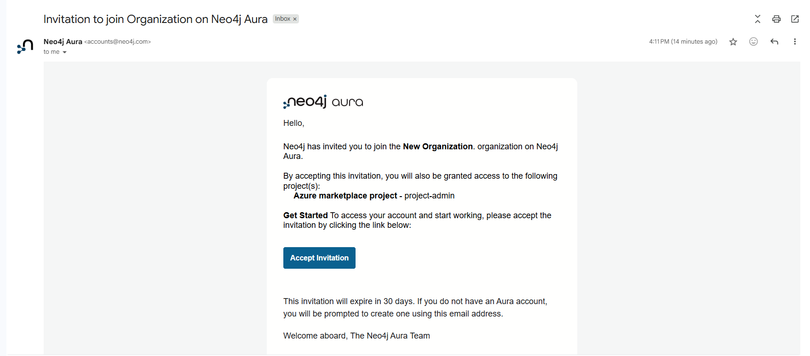

Enter your email and click "Continue"

You will receive an email to verify your identity.

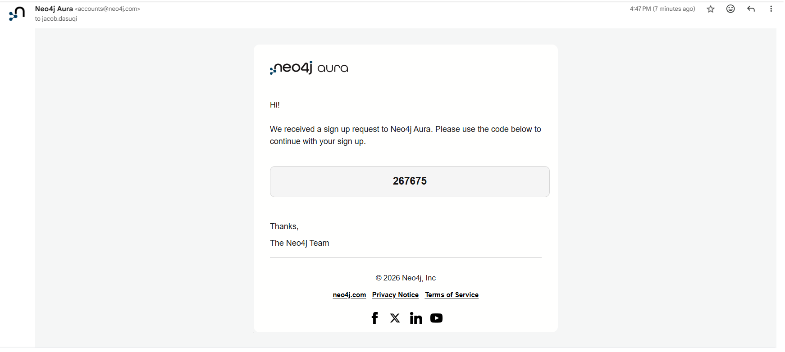

Enter the code from the email into the verification box and click "Continue".

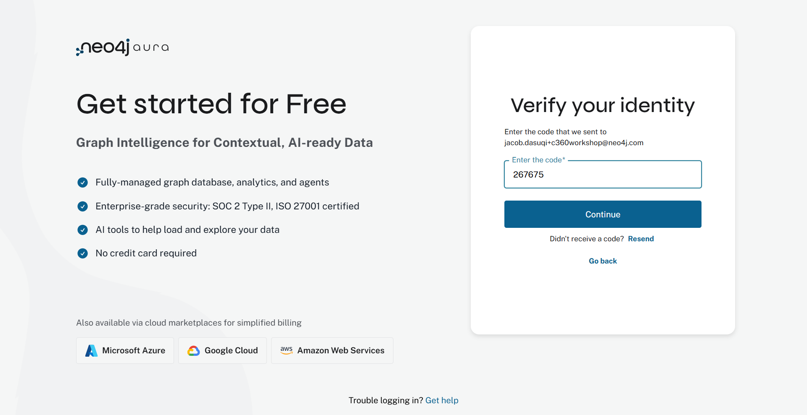

Create your password and click "Sign up".

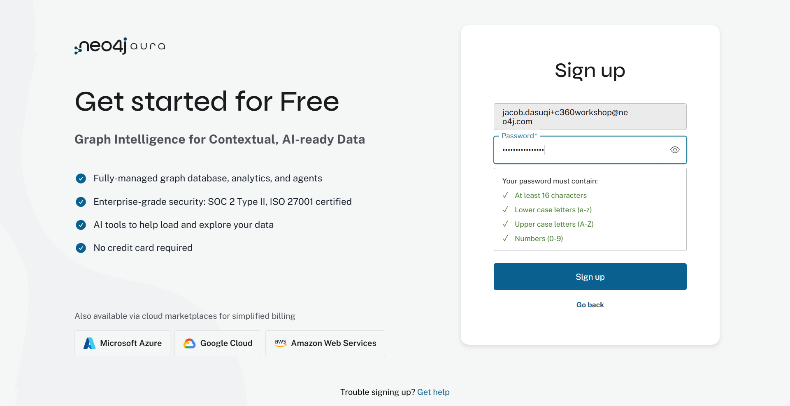

Once successfully signed up, you will be brought to the Instances page of the project you were invited to. You may see other users' instances already created. Let's begin the process to create your personal instance for the remainder of this workshop.  

Click "Create Instance"

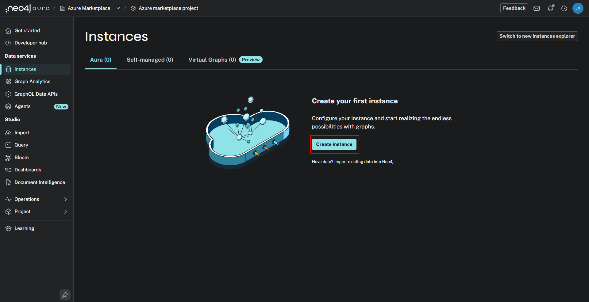

We're now presented with a choice of product tiers within Neo4j:

* Free
* Business Critical
* Professional

The Free tier is a great way to get started experimenting.  Business Critical offers a 3 node fault tolerant and highly available cluster.  We don't really need that for this lab.  The Professional tier has similar functionality with a single node.  Select "Professional."

For Instance details, name your instance "[FirstInitialLastName] Workshop" i.e. "[jdasuqi] Workshop", this will help us identify our instance from other participant's instances.

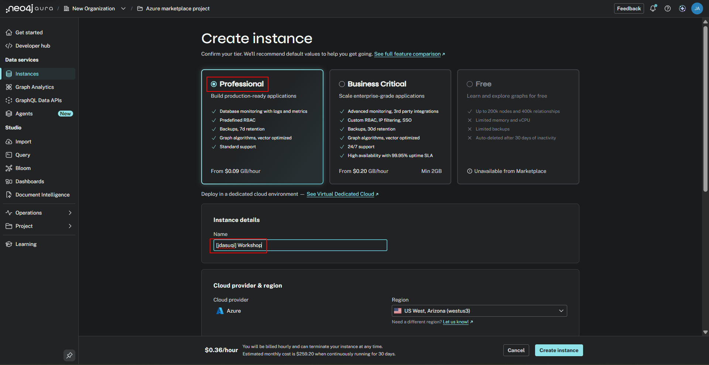

Now, let's inspect the other options.

We can deploy in different regions.

There are two options for Graph Analytics.  This feature provides access to 60+ graph alogrithms.  These run across your graph, computing things like centrality and node importance.  We'll keep the default.  That spins up computations on demand.  Another option is to collocate it in the database.

Finally, there's an option to optimize the database for vector search.  We'll be using vector functionality but our workloads will be comparatively light so we don't need this optimization.

We've reached the bottom!  Click "Create Instance."

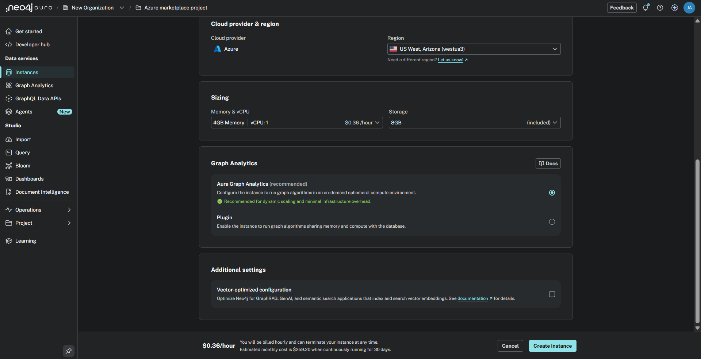

You'll be presented with the credentials for your database.  Click "Download and continue."  That will download the credentials to a text file on your local machine.  

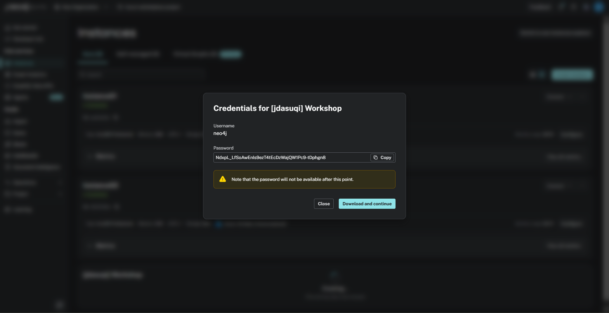

A save dialog should pop up.  Be sure to save that file as you won't be able to get those credentials later.

You'll see a dialog that your database is being created. This should only take a few minutes.

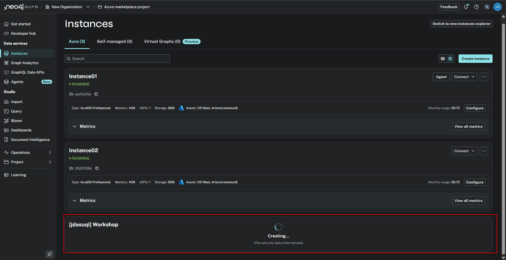

When deployment is complete, you can filter the search for your instance name and you'll see the instance details in the management console.  

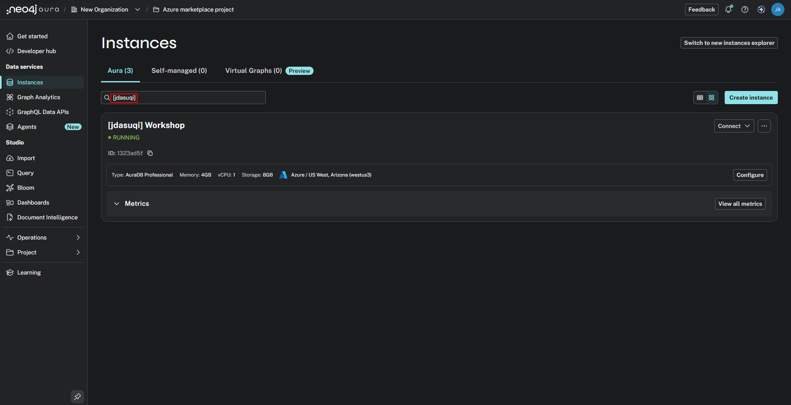

You can poke around the menus here a bit and see more on database status and connection information.

You now have a deployment of Neo4j AuraDB Professional running!

Click "Connect" then select "Query".

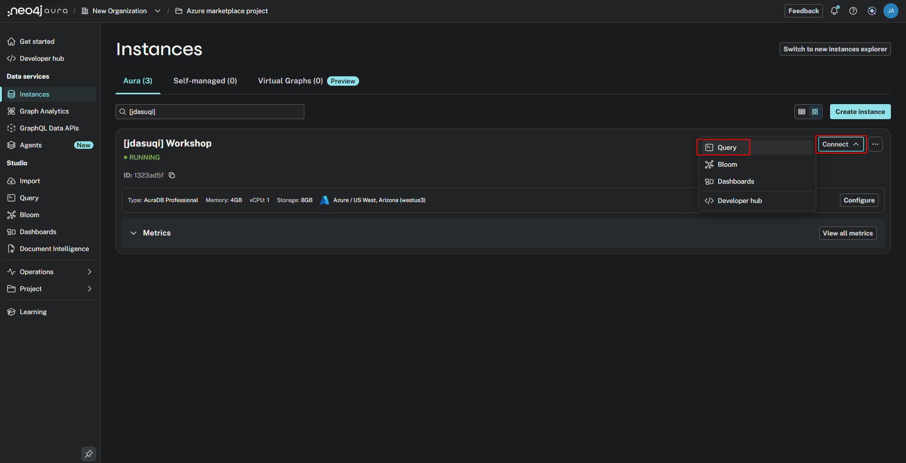

That will drop us into an empty database.

There's nothing in our database yet. We can see the nodes, relationships and property key areas are all blank.

In the next lab, we will start loading data into our instance.

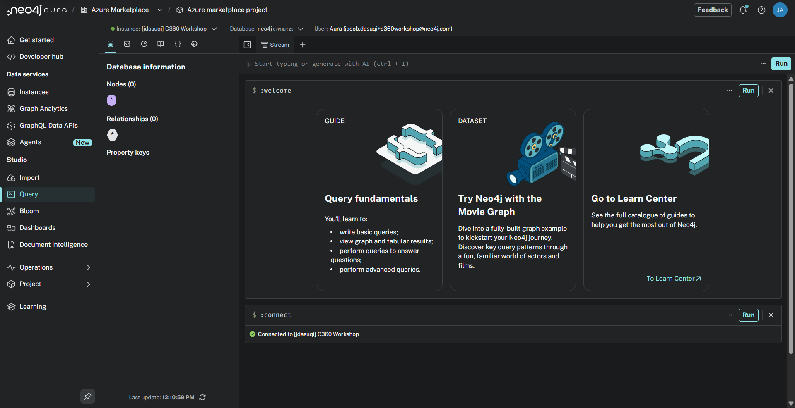