# Lab 2 - Load

In this lab, we're going to take a Customer 360 dataset from Azure Blob Storage and import it into Neo4j.  There are a few different ways to do this.  We'll start with a very naive LOAD CSV statement and then improve it.  

The Neo4j Data Importer is another option.  It's a great graphical way to import data.

Our dataset is six files:

* `customers.csv` - 48,200 CRM profiles: name, email, phone, gender, dob, signup date, address, and acquisition source.
* `customer_devices.csv` - 51,854 device registrations, one row per customer-device pair.
* `orders.csv` - 281,765 ecommerce transactions: amount, date, payment method, status, quantity.
* `products.csv` - 470 catalog products with category and price.
* `support_tickets.csv` - 30,000 support interactions with issue type, timestamps, resolution time, sentiment, and the handling agent.
* `clickstream.csv` - 473,530 web/app events: page views, searches, cart adds, and logins.  About 30% are anonymous guest traffic.

## The Data Model

Before we load anything, here's the graph we're going to build.  Take note of the relationship directions:

    (:Customer)-[:HAS_EMAIL]->(:EmailAddress)
    (:Customer)-[:HAS_PHONE]->(:Phone)
    (:Customer)-[:HAS_DEVICE]->(:Device)
    (:Customer)-[:PLACED]->(:Order)
    (:Order)-[:OF_PRODUCT]->(:Product)
    (:Customer)-[:RAISED]->(:SupportTicket)
    (:SupportTicket)-[:HANDLED_BY]->(:Agent)
    (:Event)-[:BY_CUSTOMER]->(:Customer)
    (:Event)-[:ABOUT_PRODUCT]->(:Product)

## Constraints and Indices

Let's create constraints, essentially a primary key, for each of our node types.  Every id in this dataset is a UUID or catalog code that's unique by design.  We're also creating indexes on order date and event timestamp to speed up the time-based queries we'll run later.

If you're curious, you can read a bit about the intricacies of optimizing those loads here:
* https://neo4j.com/developer/guide-import-csv/#_optimizing_load_csv_for_performance
* https://graphacademy.neo4j.com/courses/importing-cypher/

Enter this command:

    CREATE CONSTRAINT customer_key IF NOT EXISTS FOR (c:Customer)      REQUIRE c.customerId IS UNIQUE;
    CREATE CONSTRAINT email_key    IF NOT EXISTS FOR (e:EmailAddress)  REQUIRE e.email IS UNIQUE;
    CREATE CONSTRAINT phone_key    IF NOT EXISTS FOR (p:Phone)         REQUIRE p.phone IS UNIQUE;
    CREATE CONSTRAINT device_key   IF NOT EXISTS FOR (d:Device)        REQUIRE d.deviceId IS UNIQUE;
    CREATE CONSTRAINT order_key    IF NOT EXISTS FOR (o:Order)         REQUIRE o.orderId IS UNIQUE;
    CREATE CONSTRAINT product_key  IF NOT EXISTS FOR (p:Product)       REQUIRE p.productId IS UNIQUE;
    CREATE CONSTRAINT ticket_key   IF NOT EXISTS FOR (t:SupportTicket) REQUIRE t.ticketId IS UNIQUE;
    CREATE CONSTRAINT agent_key    IF NOT EXISTS FOR (a:Agent)         REQUIRE a.name IS UNIQUE;
    CREATE CONSTRAINT event_key    IF NOT EXISTS FOR (ev:Event)        REQUIRE ev.eventId IS UNIQUE;
    CREATE INDEX order_date IF NOT EXISTS FOR (o:Order) ON (o.orderDate);
    CREATE INDEX event_time IF NOT EXISTS FOR (ev:Event) ON (ev.timestamp);

It should look like the following.  You can then press "Run" to run the job.

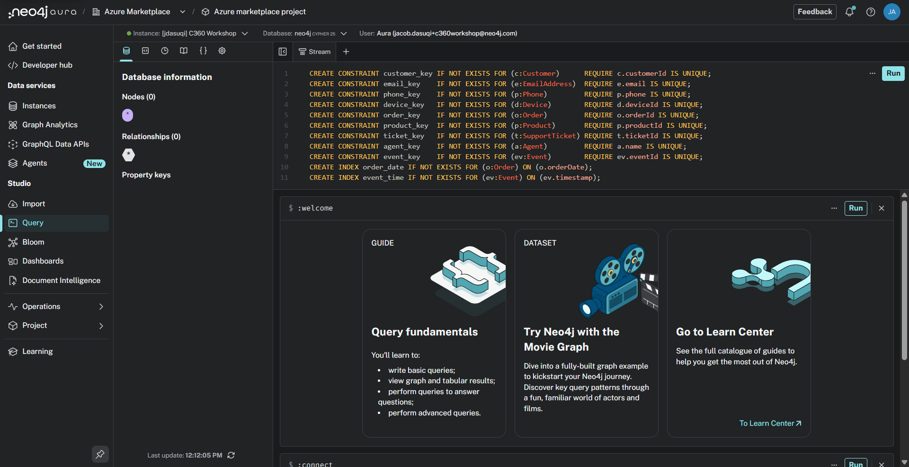

That should give this:

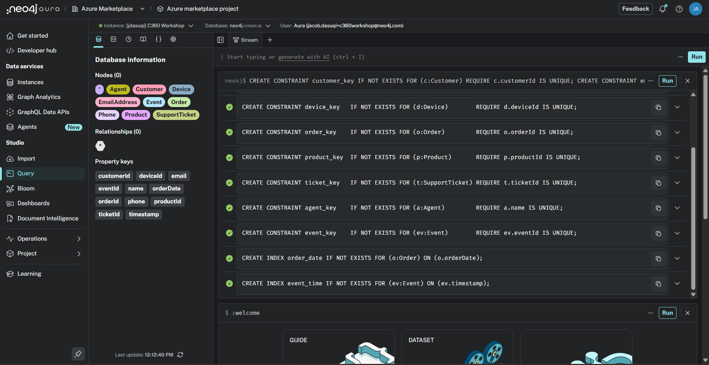

## Load Nodes and Relationships

Now that we've created constraints and indices, we can begin loading our nodes and relationships from Azure Blob Storage.  
We can start with Customer, Email, and Phone nodes (since these all derive from the same data file -- customers.csv).   
Enter the following statement into the prompt:

    LOAD CSV WITH HEADERS FROM "https://neo4jc360lab.blob.core.windows.net/neo4jc360lab/customers.csv" AS row

    MERGE (c:Customer {customerId: row.customer_id})
    SET c.firstName  = row.first_name,
        c.lastName   = row.last_name,
        c.gender     = row.gender,
        c.dob        = date(row.dob),
        c.signupDate = date(row.signup_date),
        c.address    = row.address,
        c.city       = row.city,
        c.state      = row.state,
        c.country    = row.country,
        c.source     = row.source

    FOREACH (_ IN CASE WHEN row.email IS NOT NULL THEN [1] ELSE [] END |
        MERGE (e:EmailAddress {email: row.email})
        MERGE (c)-[:HAS_EMAIL]->(e)
    )
    FOREACH (_ IN CASE WHEN row.phone_number IS NOT NULL THEN [1] ELSE [] END |
        MERGE (p:Phone {phone: row.phone_number})
        MERGE (c)-[:HAS_PHONE]->(p)
    )

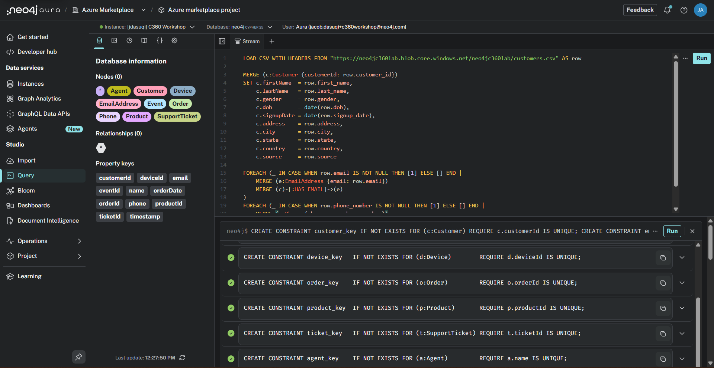

Once executed, this will load the nodes and relationships from the file.  
You'll now see the nodes, relationships and properties we loaded.

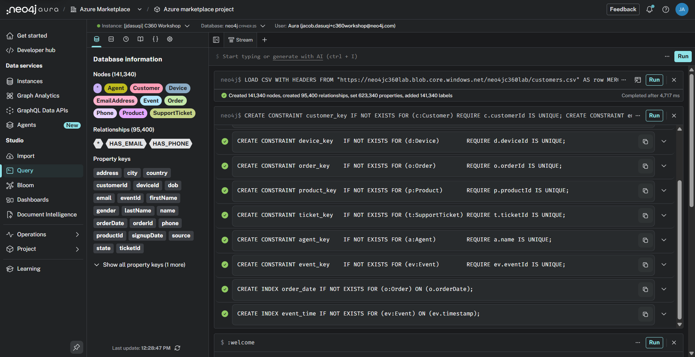

Click on "Customer" under "Nodes" to automatically generate a new cypher query and run it.

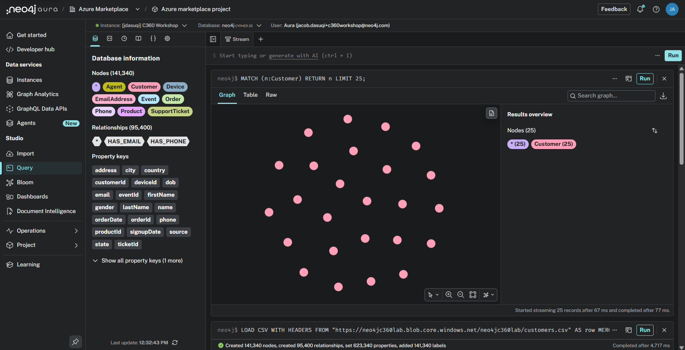

You'll now see a subset of the customers we have in the database.  The query returns 25 of them.  It's limited because returning to many nodes in this visualization mode can make it hard to navigate.

Now, let's click on one of the customers.  Don't worry, it doesn't particularly matter which one.  

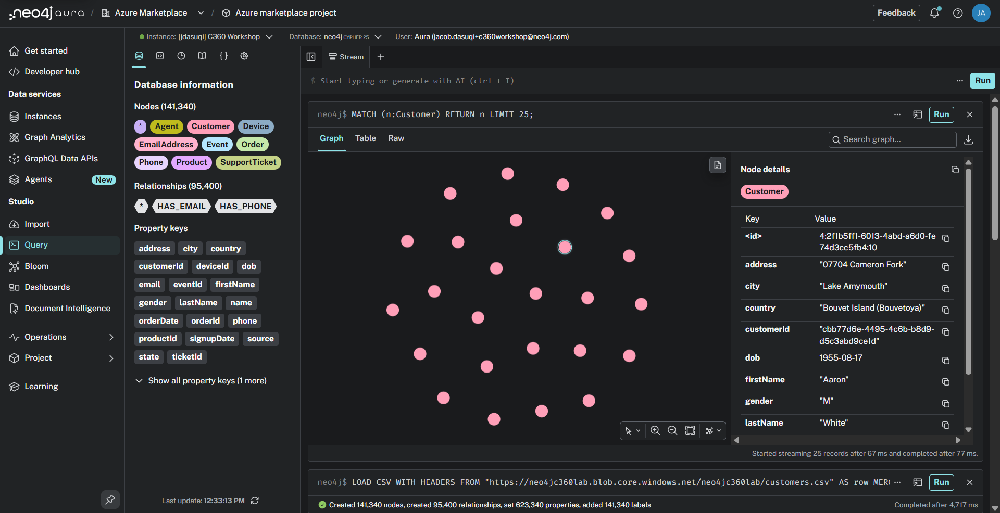

Once we've clicked on it, we can see its details.  This particular customer has a property "customerId" with value "customerId: "cbb77d6e-4495-4c6b-b8d9-d5c3abd9ce1d""

Right click on that customer to open a context menu and select "Expand selected".

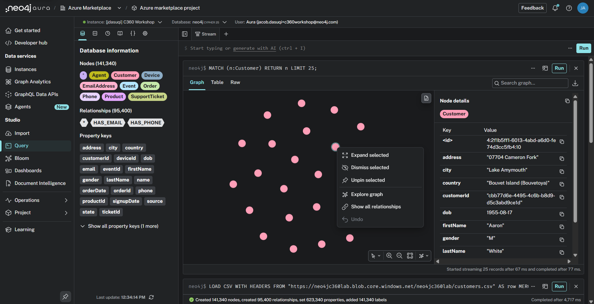

When it expands, we can see what email(s) and phone number(s) this customer has.

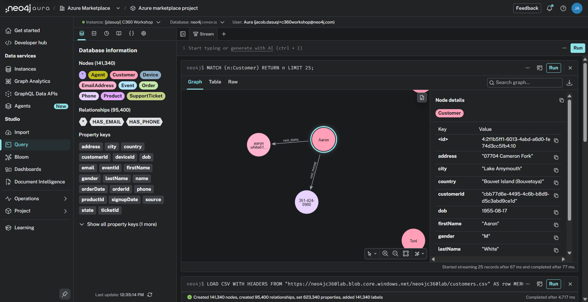

Try selecting a phone number that is connected to our customer.

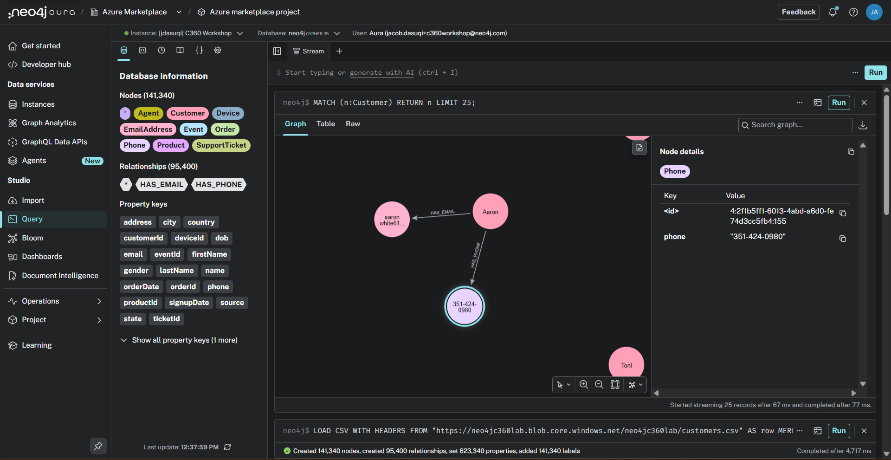

In this case, we see the phone has property phone: "351-424-0980".

We can also click on the relationship, that is the line between the nodes to see detail on the has_phone relationship.

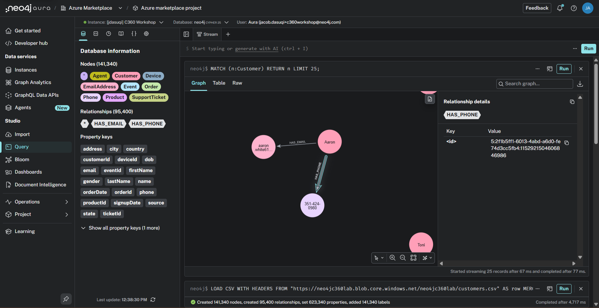

In this case, we don't have any properties stored, but relationships can store properties the same way that nodes can to store information regarding the connection between the two nodes.

Let's continue loading the rest of our dataset by importing the customer devices.  
Enter the following statement into the prompt:

    LOAD CSV WITH HEADERS FROM 'https://neo4jc360lab.blob.core.windows.net/neo4jc360lab/customer_devices.csv' AS row
    CALL (row) {
        MATCH (c:Customer {customerId: row.customer_id})
        MERGE (d:Device {deviceId: row.device_id})
        MERGE (c)-[:HAS_DEVICE]->(d)
    } 
    IN TRANSACTIONS OF 10000 ROWS;

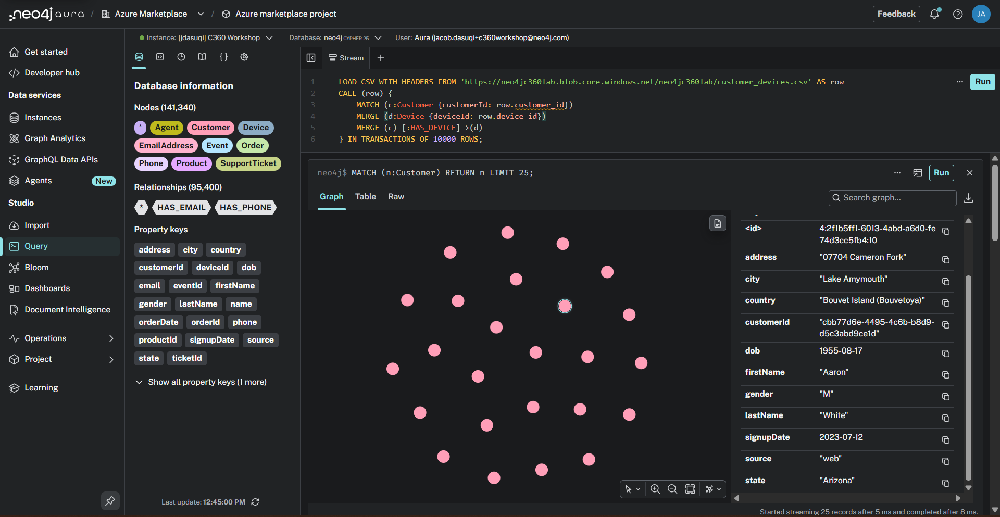

Once executed, you will see the following:

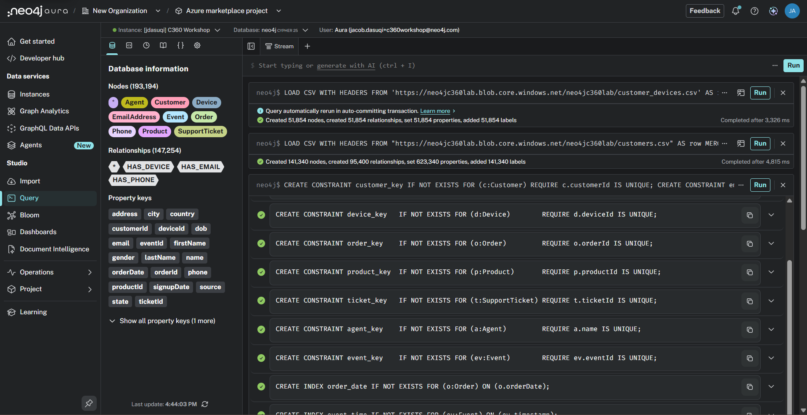

Continuing with the product catalog, enter the following statement:  

    LOAD CSV WITH HEADERS FROM 'https://neo4jc360lab.blob.core.windows.net/neo4jc360lab/products.csv' AS row
    MERGE (p:Product {productId: row.product_id})
    SET p.name = row.product_name, p.category = row.category, p.price = toFloat(row.price);

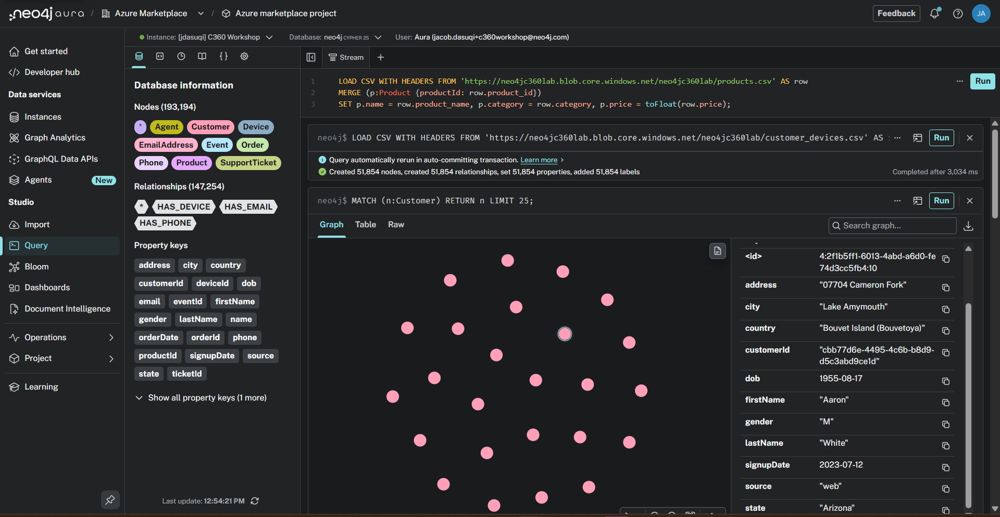

Once executed, you will see the following:

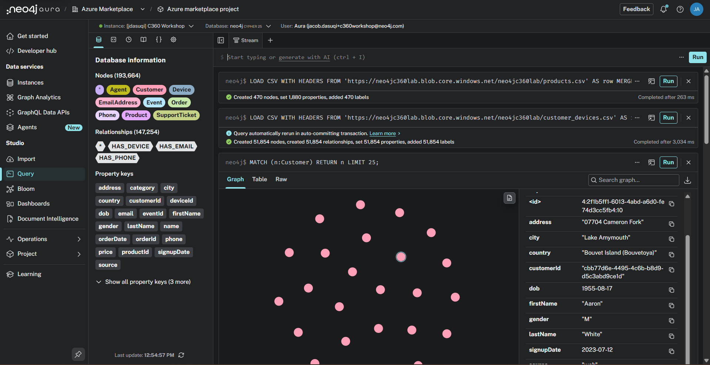

Now the orders. Because there are a lot of them, we're going to batch the load. That will avoid big memory allocations, making this query run more predictably and within the allocated heap. Take some time to investigate how the relationships are loaded during this command. We're creating relationships from Customer to Order and Order to Product.

    LOAD CSV WITH HEADERS FROM 'https://neo4jc360lab.blob.core.windows.net/neo4jc360lab/orders.csv' AS row
    CALL (row) {
        CREATE (o:Order {orderId: row.order_id})
        SET o.amount        = toFloat(row.order_amount),
            o.orderDate     = datetime(row.order_date),
            o.paymentMethod = row.payment_method,
            o.status        = row.status,
            o.quantity      = toInteger(row.quantity)
        WITH row, o
        MATCH (c:Customer {customerId: row.customer_id})
        MATCH (p:Product  {productId:  row.product_id})
        MERGE (c)-[:PLACED]->(o)
        MERGE (o)-[:OF_PRODUCT]->(p)
    }
    IN TRANSACTIONS OF 10000 ROWS;

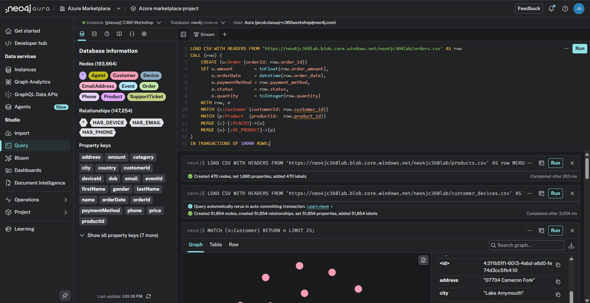

Once executed, you will see the following:

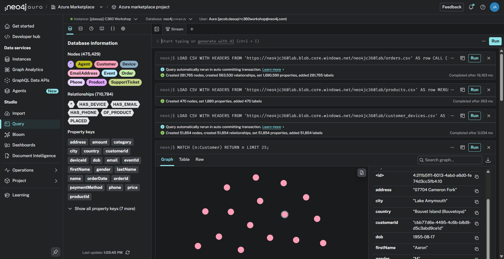

Next, the support tickets, connecting each one to its customer and to the agent who handled it:

    LOAD CSV WITH HEADERS FROM 'https://neo4jc360lab.blob.core.windows.net/neo4jc360lab/support_tickets.csv' AS row
    CALL (row) {
        CREATE (t:SupportTicket {ticketId: row.ticket_id})
        SET t.issueType       = row.issue_type,
            t.sentiment       = row.sentiment,
            t.resolutionHours = toFloat(row.resolution_time_hours),
            t.created         = datetime(row.ticket_created),
            t.resolved        = datetime(row.ticket_resolved)
        WITH row, t
        MATCH (c:Customer {customerId: row.customer_id})
        MERGE (a:Agent {name: row.support_agent})
        MERGE (c)-[:RAISED]->(t)
        MERGE (t)-[:HANDLED_BY]->(a)
    }
    IN TRANSACTIONS OF 10000 ROWS;

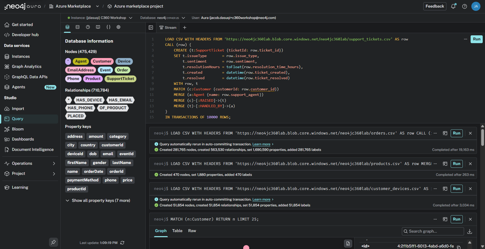

Once executed, you will see the following:

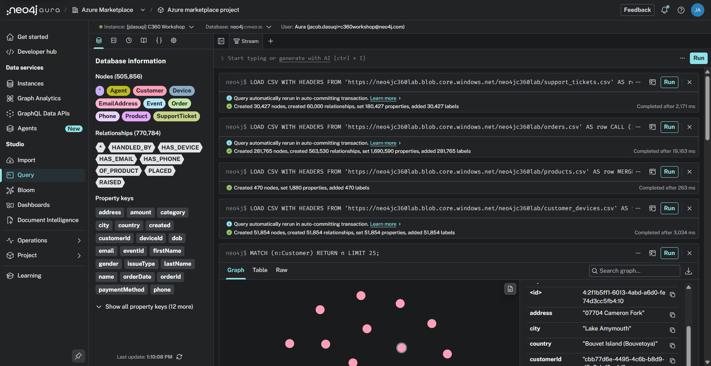

And finally the big one: half a million clickstream events. Two things to notice here. About 30% of events are anonymous guest traffic with no customer id - the FOREACH trick means those events still load, they just don't get a BY_CUSTOMER relationship. Additionally, when the page URL is a product page, we're extracting the product id, so that those events link straight to the catalog.

    LOAD CSV WITH HEADERS FROM 'https://neo4jc360lab.blob.core.windows.net/neo4jc360lab/clickstream.csv' AS row
    CALL (row) {
        CREATE (ev:Event {eventId: row.event_id})
        SET ev.type      = row.event_type,
            ev.sessionId = row.session_id,
            ev.pageUrl   = row.page_url,
            ev.deviceId  = row.device_id,
            ev.timestamp = datetime(row.timestamp)
        FOREACH (_ IN CASE WHEN row.customer_id IS NOT NULL THEN [1] ELSE [] END |
            MERGE (c:Customer {customerId: row.customer_id})
            MERGE (ev)-[:BY_CUSTOMER]->(c)
        )
        FOREACH (_ IN CASE WHEN row.product_id IS NOT NULL THEN [1] ELSE [] END |
            MERGE (p:Product {productId: row.product_id})
            MERGE (ev)-[:ABOUT_PRODUCT]->(p)
        )
    }
    IN TRANSACTIONS OF 10000 ROWS;

This statement may take up to 1 minute to complete.

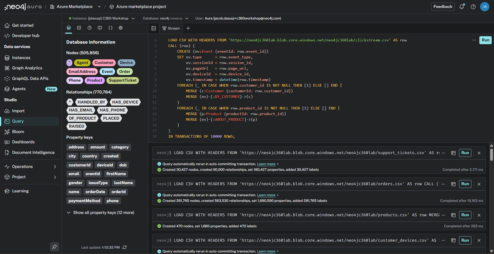

Once executed, you will see the following:

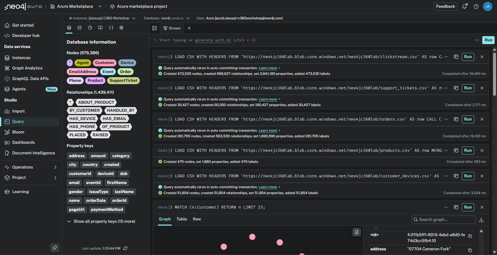

You've done it!  We've loaded our data set up.  We'll explore it in the next lab.  But, feel free to poke around a bit as well.
