# Lab 3 - Query

In this lab, we're going to take the data we loaded into Neo4j and start to experiment with queries we can execute to investigate the nodes and relationships. We will also take a look at how easy it is to expand on a data model within Neo4j by adding a relationships.  

## Who are our top customers?

Now that we've loaded the data into Neo4j, we can start asking questions about the data.  Let's start with the question every retail leadership team asks first: "Who are our top customers?"

Copy this command into the query field.  You can then press "Run".

    MATCH (c:Customer)-[:PLACED]->(o:Order)
    WHERE o.status = 'success'
    WITH c, round(sum(o.amount)) AS revenue, count(o) AS orders
    RETURN c.customerId AS customerId,
        c.firstName + ' ' + c.lastName AS name,
        revenue, orders
    ORDER BY revenue DESC
    LIMIT 10

It should look like the following.

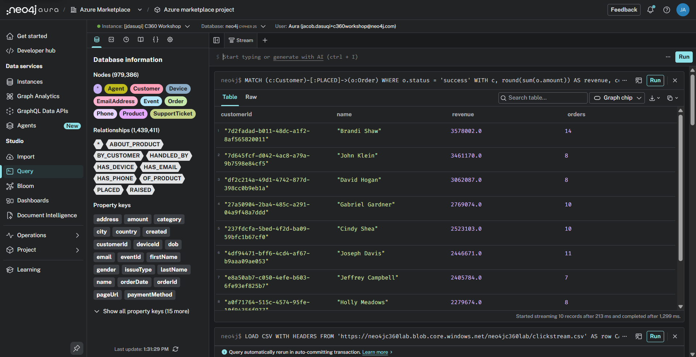

Brandi Shaw tops the list at about $3.58M of lifetime revenue, and the tenth spot on the list comes in around $2.21M.

## Who is this customer, really?

Let's get a better sense of what our graph actually looks like.  We'll pick one mid-tier customer and pull their entire footprint in a single query: identity, orders, and support history.

Copy this command into the query field.  You can then press "Run".

    MATCH p = (c:Customer {customerId: '70e4dde7-4705-4652-b3d1-f015cb8a6d5c'})-[:HAS_EMAIL|HAS_PHONE|HAS_DEVICE|PLACED|RAISED]->()
    RETURN p

It should look like the following.

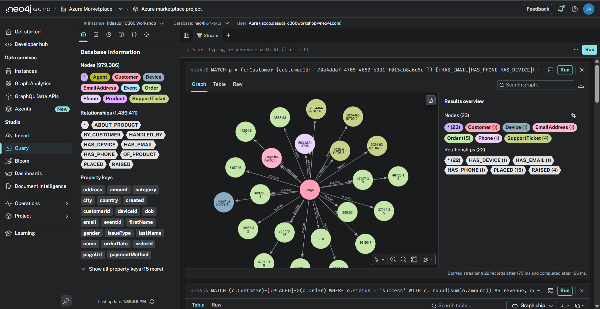

This is the customer 360 view in one query: the person, their email, phone, and devices, every order they've placed, and every support ticket they've raised, in a single connected picture.  
In a relational system, this view is a six-way join that someone has to design, maintain, and keep in sync with the application. Within Neo4j, we're able to just traverse the relationships between these nodes with this single statement.

This particular customer, Jorge Haney, is worth a closer look.  Click around his orders and you'll notice a pattern.  Let's quantify it:

    MATCH (c:Customer {customerId: '70e4dde7-4705-4652-b3d1-f015cb8a6d5c'})-[:PLACED]->(o:Order)
    RETURN o.status AS status, count(*) AS orders, round(sum(o.amount)) AS value
    ORDER BY orders DESC

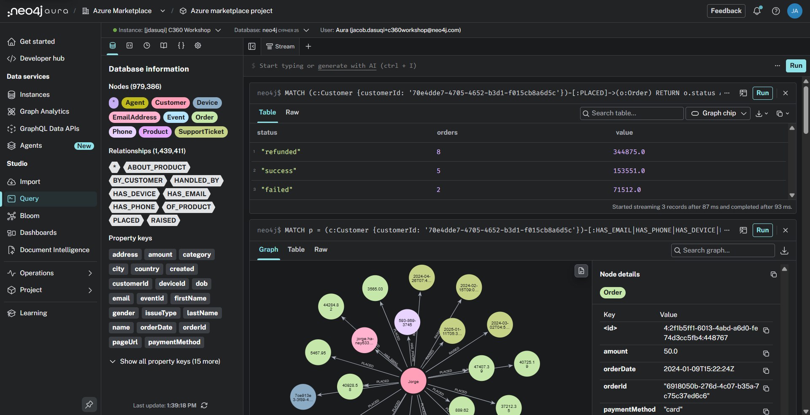

Fifteen orders, eight of them refunded.  More refunds than successes, from a customer who's also raised four support tickets.  A CRM row can't tell you this person is halfway out the door.  A graph makes it hard to miss.

That's one blind spot a graph exposes. There's another, hiding in the same dataset: some of these "different" customers might not be different people at all.

Can you think of a way to modify our data model so that "customers who share identity information" becomes something we can *see*, rather than something we have to hunt for?

## SHARED_PII Relationship

Back in the Load lab we noticed the math doesn't add up: 48,200 customers but only 46,363 email addresses.  Because identity values are *nodes*, two customers who share an email aren't just two rows with a matching column - they're two nodes with a path between them.  Let's look at that path.

Copy this command into the query field.  You can then press "Run".

    MATCH (c1:Customer)-[:HAS_EMAIL]->(e:EmailAddress)<-[:HAS_EMAIL]-(c2:Customer)
    WHERE c1.customerId < c2.customerId
    RETURN c1.firstName + ' ' + c1.lastName AS name1,
        c2.firstName + ' ' + c2.lastName AS name2,
        e.email AS sharedEmail
    LIMIT 10

It should look like the following.

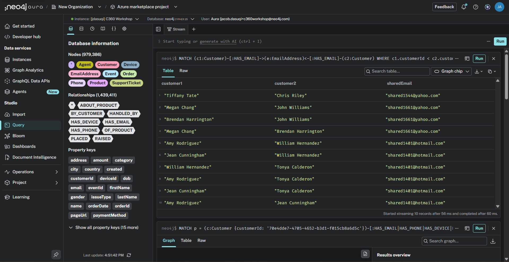

Different customer IDs, different names - same email address.  There are 450 shared emails and 500 shared phone numbers in this CRM, touching 3,210 accounts.  

This can be verified with the below query:

    OPTIONAL MATCH (c:Customer)-[:HAS_EMAIL]->(e:EmailAddress)
    WITH e, count(c) AS customerCount
    WHERE customerCount > 1 OR e IS NULL
    WITH count(e) AS sharedEmails
    OPTIONAL MATCH (c2:Customer)-[:HAS_PHONE]->(p:Phone)
    WITH sharedEmails, p, count(c2) AS phoneCount
    WHERE phoneCount > 1 OR p IS NULL
    RETURN sharedEmails, count(p) AS sharedPhones

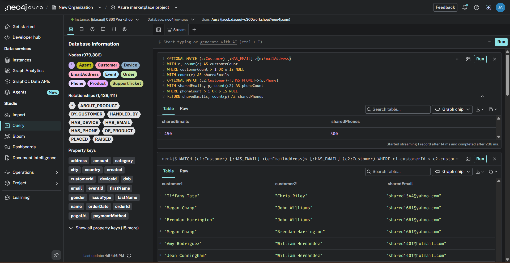

Now, computing "who shares identity with whom" on every query means re-walking those paths every time.  What if it wasn't something we compute, but something we just store as a relationship between the two customers?  Compute it once, write it down as an edge, and "is this a duplicate?" becomes one "hop" in the graph.

Copy this command into the query field.  You can then press "Run".

    MATCH (c1:Customer)-[:HAS_EMAIL|HAS_PHONE]->(pii)<-[:HAS_EMAIL|HAS_PHONE]-(c2:Customer)
    WHERE c1.customerId < c2.customerId
    WITH c1, c2, count(DISTINCT pii) AS sharedIdentifiers
    MERGE (c1)-[s:SHARED_PII]->(c2)
    SET s.sharedIdentifiers = sharedIdentifiers

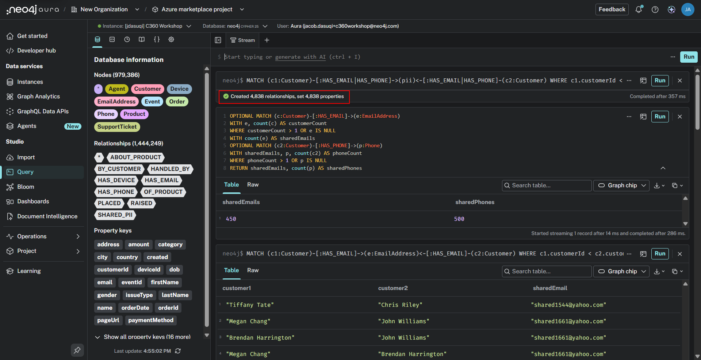

We've now created a SHARED_PII relationship between every pair of customer accounts that share an email or a phone number.  
Let's visualize the duplicate-suspect network using a variable-length path operation in Cypher. This is going to allow us to match from X to Y hops along a relationship type in a single pattern.   

In this case, we're going to match for a 

    MATCH p = (:Customer)-[:SHARED_PII]-(:Customer)
    RETURN p
    LIMIT 100

It should look like the following.

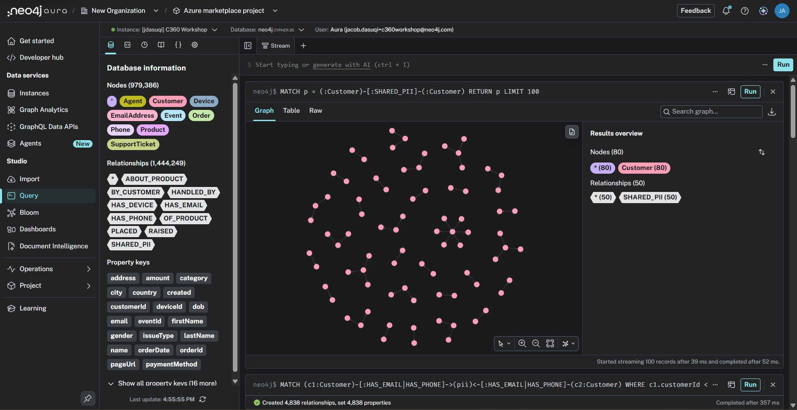

Clusters.  Not pairs - *clusters*.  The biggest rings connect eight or nine "different" customer accounts through one shared identifier.

We can also leverage a variable-length path operation in Cypher.  This is going to allow us to match from X to Y hops along a relationship type in a single pattern - so accounts linked *transitively* (A shares with B, B shares with C) resolve into one connected identity:

    MATCH (seed:Customer {customerId: '09233151-376b-4332-b3a7-0e8c7e138a82'})
    MATCH path = (seed)-[:SHARED_PII*1..4]-(other:Customer)
    RETURN path

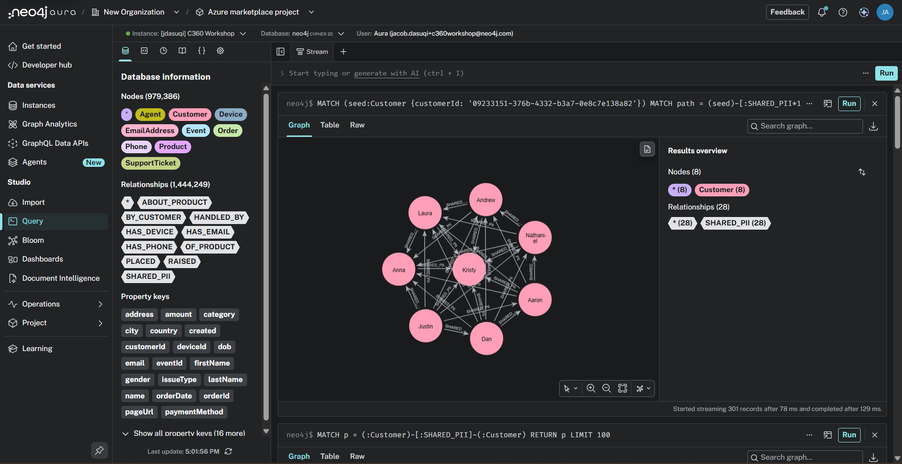

Feel free to experiment with the query by changing the minimum and/or maximum length of the path.

## The Real Top-Customer List

Let's revisit our top-customers. If we define a "customer" as an actual, resolved identity - an account plus everything it shares PII with - then revenue should be counted per *identity*, not per account.  Let's re-rank:

    MATCH (c:Customer)-[:HAS_EMAIL]->(e:EmailAddress)
    WITH e, collect(c) AS accounts
    WHERE size(accounts) > 1
    UNWIND accounts AS c
    MATCH (c)-[:PLACED]->(o:Order)
    WHERE o.status = 'success'
    WITH e.email AS sharedEmail,
        size(accounts) AS accounts,
        round(sum(o.amount)) AS combinedRevenue
    RETURN sharedEmail, accounts, combinedRevenue
    ORDER BY combinedRevenue DESC
    LIMIT 5

It should look like the following.

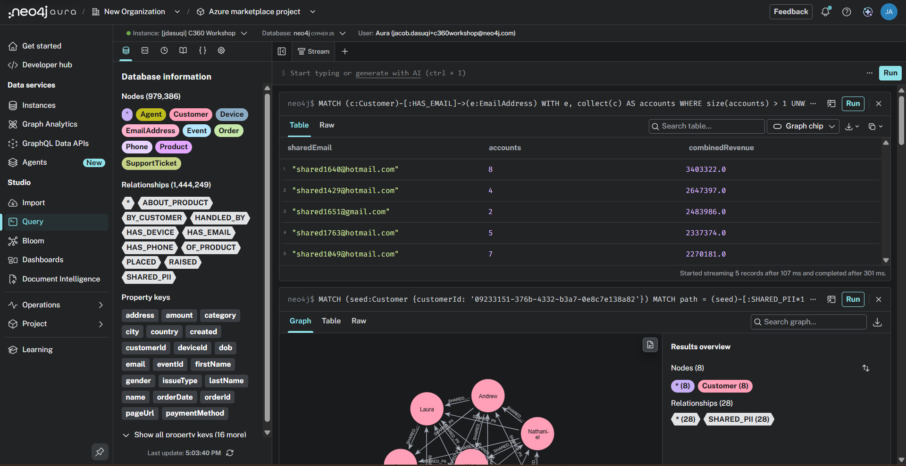

The identity behind `shared1640@hotmail.com` spans the **eight accounts** our variable-length path cypher returned - Justin Moore, Dan Medina, Aaron Richards, Nathaniel Myers, Andrew Love, Laura Pham, Anna Madden, Kristy Mcconnell - with a combined **$3.40M** of successful revenue.  None of which appear anywhere on the top-10 list we ran at the start of this lab, because no single one of their accounts is big enough to crack it.

Marketing is emailing this person eight times.  Support sees eight strangers.  Finance counts eight small customers instead of one whale.  That's what unresolved identity costs, and we found it with three Cypher queries.

## What did they want but not buy?

One more expansion of the model - this time from the behavioral side.  The clickstream knows something the order table doesn't: intent.  Let's roll our raw events up into a single relationship: customer *added this product to cart*.

    MATCH (ev:Event {type: 'add_to_cart'})-[:BY_CUSTOMER]->(c:Customer),
          (ev)-[:ABOUT_PRODUCT]->(p:Product)
    WITH c, p, count(ev) AS adds
    MERGE (c)-[r:ADDED_TO_CART]->(p)
    SET r.times = adds

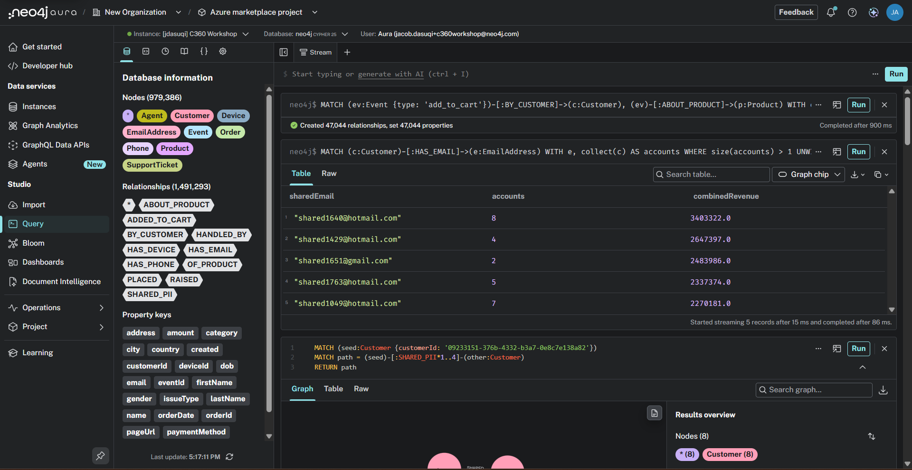

Now cross it against what the customer actually bought.  Products in the cart with no matching successful order = abandoned intent, per customer, ready for a re-marketing campaign:

    MATCH (c:Customer)-[:ADDED_TO_CART]->(p:Product)
    WHERE NOT EXISTS {
        MATCH (c)-[:PLACED]->(o:Order)-[:OF_PRODUCT]->(p)
        WHERE o.status = 'success'
    }
    RETURN c.firstName + ' ' + c.lastName AS customer,
        p.name AS product, p.category AS category ORDER BY customer
    LIMIT 10

It should look like the following.

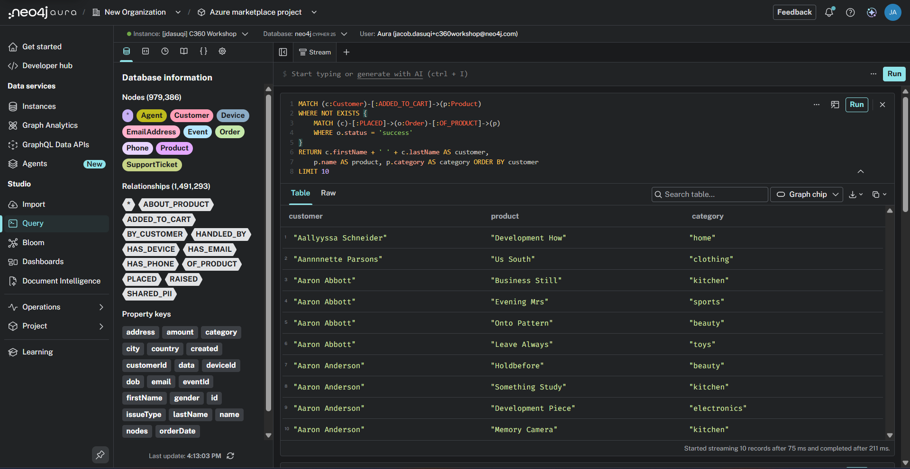

Across the whole graph, that's over 47,000 customer-product cart adds, and almost none of them converted.  Every row of this result is a warm lead with a name, an email address - and now, thanks to SHARED_PII, a *deduplicated* email address.

## How engaged are customers after opening a support ticket with a negative sentiment?

Let's take a look at one final query to investigate customer engagement after opening a support ticket that they reviewed with a negative experience.

Enter the following query:

    MATCH path = (s:SupportTicket)-[r:RAISED]-(c:Customer)-[p:PLACED]-(o:Order)
    WHERE s.sentiment = "negative"
    AND o.orderDate > s.created
    RETURN path
    LIMIT 50

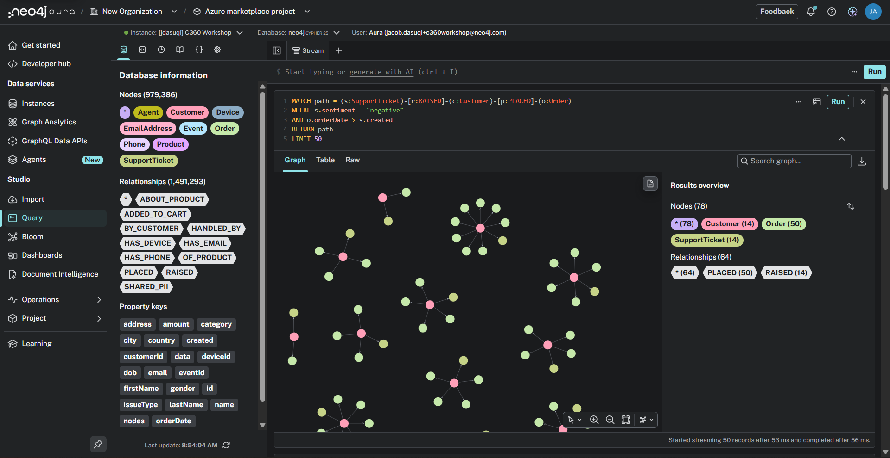

With this exploration, we're able to investigate if customers are continuing to place orders, despite having a negative support ticket experience.

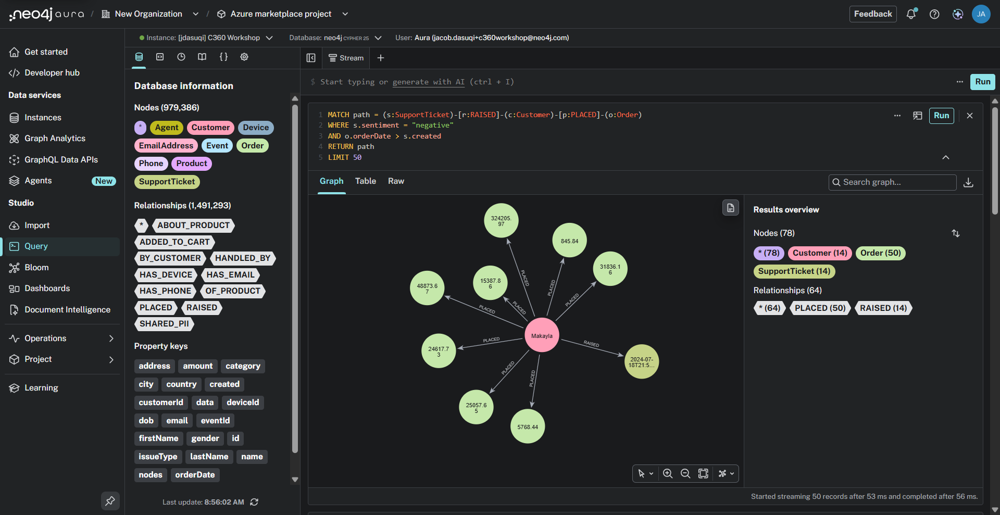

This is the heart of Customer 360: the "360" isn't a dashboard, it's the resolved identity plus everything connected to it - orders, tickets, and intent.

In the next lab, we'll look at how we can leverage a Neo4j Aura Agent to perform analysis like this agentically.