# Lab 4 - Aura Agent

In this lab, you'll create an AI agent in the Neo4j Aura console.  By the end of this lab, you should be able to answer the question: **why does this agent need a graph underneath it?**

An LLM is a reasoning engine with no knowledge of your business.  When you connect it to a relational database, the meaning of your data stays hidden: it lives in join keys, in application code, and in your analysts' heads.  The model has to guess how `orders.customer_id` relates to anything else, and every guess is a chance to hallucinate.

A knowledge graph works differently.  The schema itself carries the meaning: `(:Customer)-[:PLACED]->(:Order)-[:OF_PRODUCT]->(:Product)`, `(:Customer)-[:RAISED]->(:SupportTicket)-[:HANDLED_BY]->(:Agent)`, and `(:Customer)-[:SHARED_PII]->(:Customer)` connecting accounts that share an identity.  When the agent reads this schema, it reads your business vocabulary.  Relationships are facts stored in the database, so **the agent traverses them instead of inferring them**.

This is the core idea behind what Jesús Barrasa, Neo4j's AI Field CTO, calls the [Enterprise Knowledge Layer](https://neo4j.com/blog/agentic-ai/enterprise-knowledge-layer/): a shared, governed place where the enterprise's knowledge lives, so agents can stay light and read meaning from the substrate instead of each one rebuilding it from scratch.

You'll see that idea in miniature in this lab.  Watch for two things:

1. **The agent's instructions define business terms once** (what a "resolved identity" is, what a "churn risk" looks like).  Every user who talks to this agent inherits the same definitions.

2. **The questions get harder in a specific way**: each one adds hops.  Hops are where relational databases fall behind and where graphs, and the agents that sit on them, pull ahead.

## The evidence: accuracy, speed, and token cost

Before you build, it's worth knowing this claim is measured, not just argued. Independent and peer-reviewed studies have compared LLM agents on knowledge graphs against agents on SQL databases and vector stores:

| What was measured | Result | Source |
|---|---|---|
| Truthfulness of agent answers on 510 complex, multi-hop questions | Graph + vector RAG was **80% more truthful** than vector-only RAG, and answered 65.3% of questions vs. 28.9% | [NICD (Newcastle University) independent study](https://neo4j.com/blog/agentic-ai/study-graphrag-ai-agents-80-percent-more-truthful/) |
| LLM accuracy answering business questions: knowledge graph vs. SQL database of the *same data* | **54.2% on the knowledge graph vs. 16.7% accuracy on SQL** - roughly 3x | [data.world benchmark, arXiv:2311.07509](https://arxiv.org/abs/2311.07509) |
| Correct answers on complex, multi-step queries: GraphRAG vs. vector RAG | **81.67% vs. 57.50%** correct | [Lettria (AWS partner) benchmark](https://www.lettria.com/blogpost/vectorrag-vs-graphrag-a-convincing-comparison) |
| Production speed: LinkedIn customer support QA with a knowledge graph | Retrieval quality up **77.6% (MRR)**; median issue resolution time down **28.6%** (mean 40 hrs → 15 hrs) | [LinkedIn, SIGIR 2024, arXiv:2404.17723](https://arxiv.org/abs/2404.17723) |
| Token cost: graph community summaries vs. raw-text summarization | **26-97% fewer tokens** per query at comparable or better quality | [Microsoft Research GraphRAG, arXiv:2404.16130](https://arxiv.org/pdf/2404.16130) |

The only variable was whether the model queried the SQL schema directly or a knowledge graph with an ontology on top. Accuracy tripled. Token consumption reduced.

## Create the agent

In the Neo4j Aura console, select "Agents."

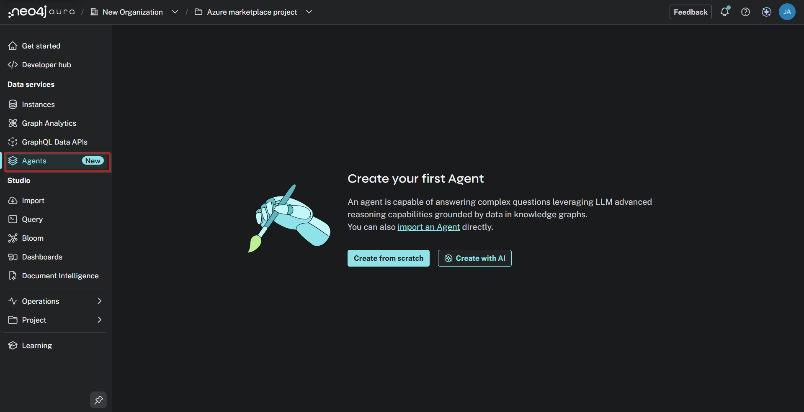

Click "Create with AI."

Enter this prompt:

    This database is a Customer 360 knowledge graph for an online retailer.
    Customer nodes connect to Order nodes via PLACED, and orders connect to Product nodes via OF_PRODUCT.
    Customers connect to SupportTicket nodes via RAISED, and tickets connect to Agent nodes via HANDLED_BY.
    Customers connect to EmailAddress, Phone, and Device nodes via HAS_EMAIL, HAS_PHONE, and HAS_DEVICE, and to each other via SHARED_PII when accounts share identity values.
    Clickstream Event nodes connect to customers via BY_CUSTOMER and to products via ABOUT_PRODUCT, and customers connect to products they carted via ADDED_TO_CART.
    Orders carry amount, orderDate, paymentMethod, status, and quantity. Tickets carry issueType, sentiment, and resolutionHours.
    I want an agent that behaves like a customer intelligence analyst.
    It should resolve customer identities across SHARED_PII connections, compute revenue and refund behavior per resolved identity, and combine orders, support tickets, and clickstream intent into churn-risk assessments.

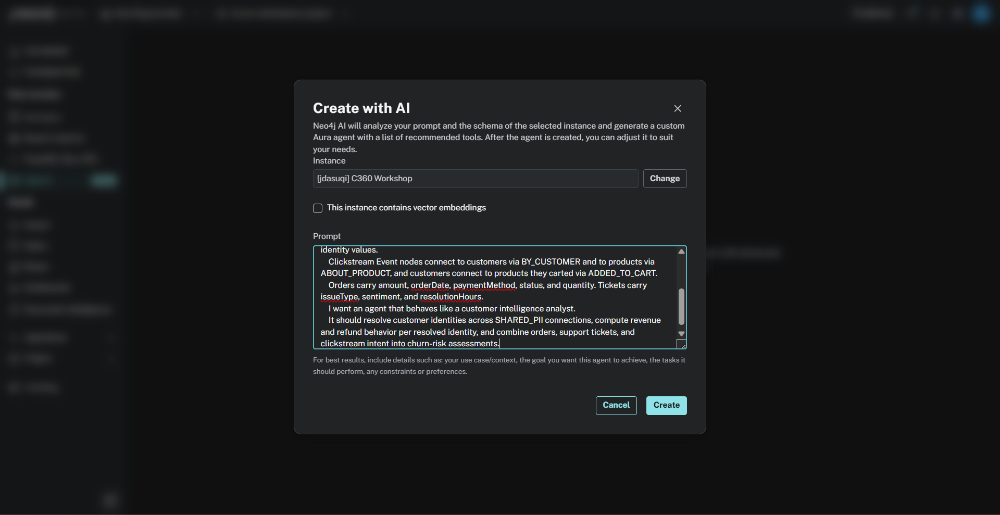

Click "Create." and wait for the agent configuration to complete.

For description, enter:

    A customer intelligence analyst grounded in a Customer 360 knowledge graph.
    Answers questions about customer identity resolution across shared PII, revenue and refund behavior, support experience, and clickstream intent.
    Every answer is derived from graph traversals over Customers, Orders, Products, SupportTickets, Agents, and identity nodes, so results are explainable and traceable.

For prompt instructions, enter:

    You are a customer intelligence analyst for an online retailer. Ground every answer in the graph; never invent data.
    Use these shared definitions consistently: a "duplicate suspect" is a pair of Customer nodes connected by SHARED_PII;
    a "resolved identity" is the set of Customer accounts connected to each other through one or more SHARED_PII hops, and its revenue is the sum across all member accounts;
    a "churn risk" is a customer whose refunded orders outnumber their successful orders, or who has raised a negative-sentiment support ticket alongside multiple refunds;
    revenue always means the sum of Order.amount where toLower(Order.status) = 'success'; refund exposure means the sum where toLower(Order.status) = 'refunded';
    "abandoned intent" is an ADDED_TO_CART relationship with no matching successful order for the same customer and product.
    When you answer, briefly state which relationships you traversed so the result is traceable.
    Prefer ranked lists and counts. Be concise and factual.

Take a moment to read through these instructions, because this is the semantic layer idea in practice.  The definitions of "resolved identity", "churn risk", and "abandoned intent" are now written down once, in a governed place, and every user of this agent inherits it.  Six analysts asking six differently worded questions all get answers computed from the same definition.  In a relational setup, that definition would live in whoever's SQL happened to run that day.

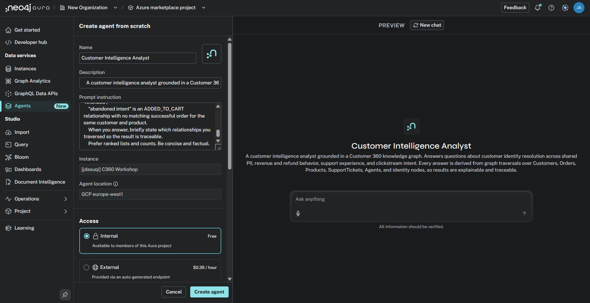

For this exercise, we will not be connecting to an external MCP server. We will touch on the capabilities available around this at the end. For now, ensure Internal Access is selected and click "Create agent".

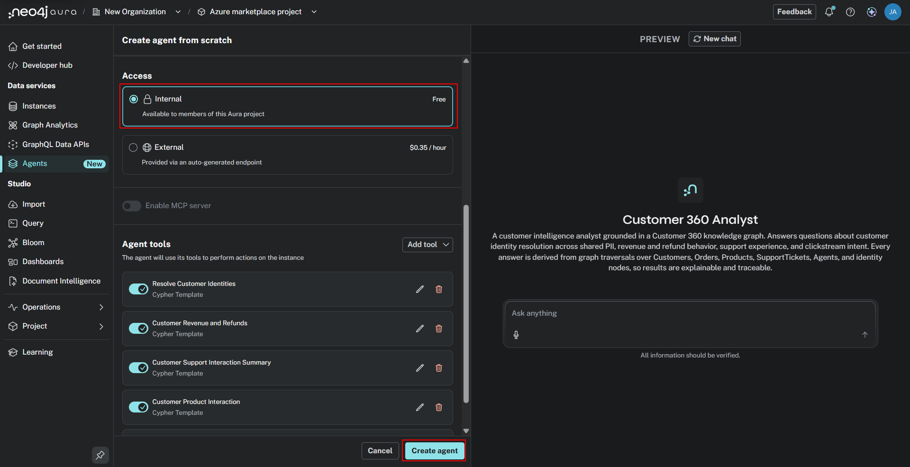

Once the agent is successfully created, select it and you will see the following:

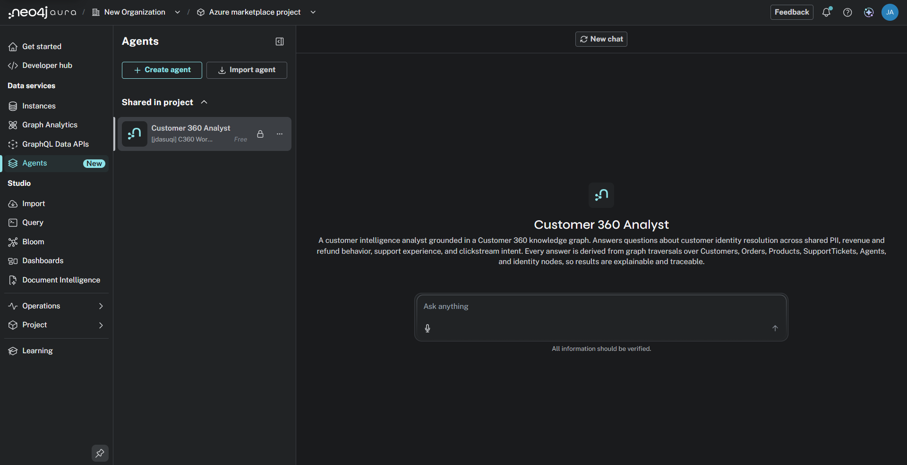

## Talking to the agent

In the prompt, enter and execute the following question:

    Who are our top 10 customers by successful order revenue?

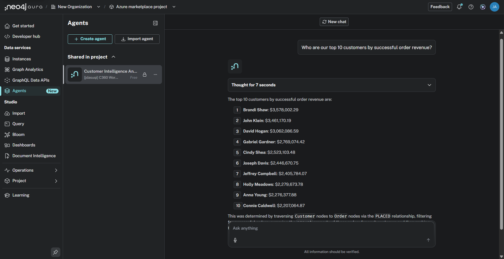

Click the drop down menu "Thought for X seconds" to view the agent reasonings, tool(s) leveraged, and Cypher query generated by the agent for this prompt. We encourage you to explore these details for each of our prompts!

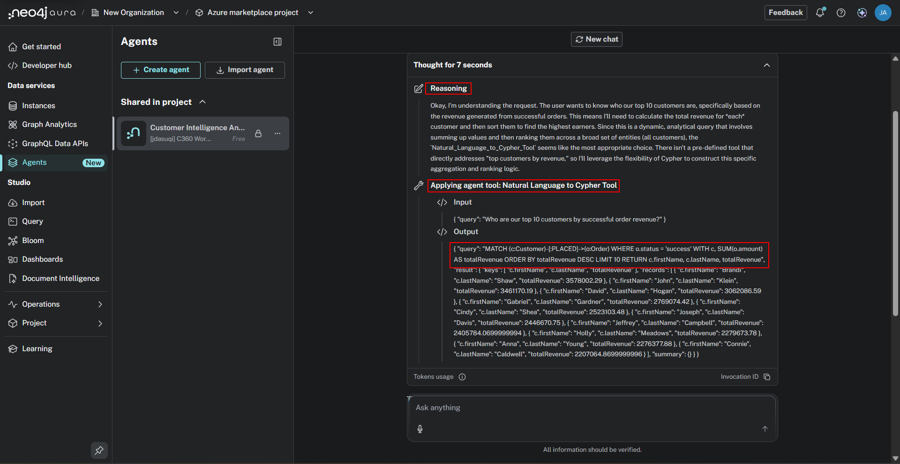

We're going to increase the complexity with each prompt. Let's enter a question that requires the agent to traverse the SHARED_PII relationship in our graph.

But first, let's configure the Get Linked Customer Identities Agent Tool (your tool may have a slightly different name).
Click the 3 dots next to your agent and click "Configure".

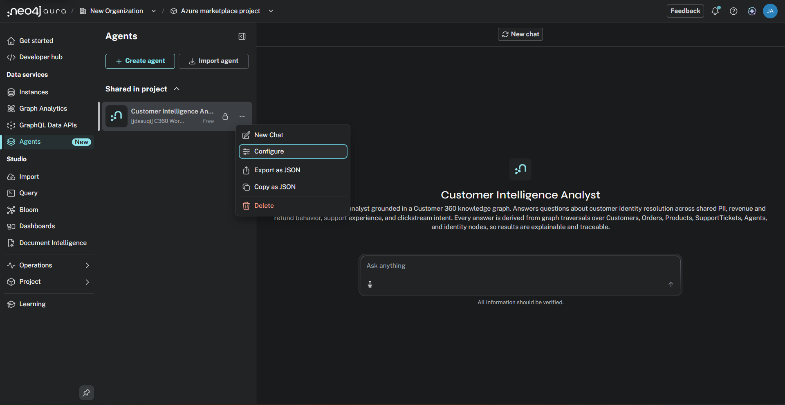

Scroll down to the list of Agent Tools, find "Get Linked Customer Identities" (your tool may have a slightly different name) and select "Edit Tool".

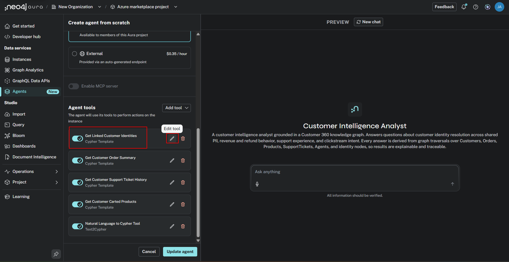

Here, you'll see the description of the tool, any parameters assigned to the tool, and the associated Cypher query the tool leverages.

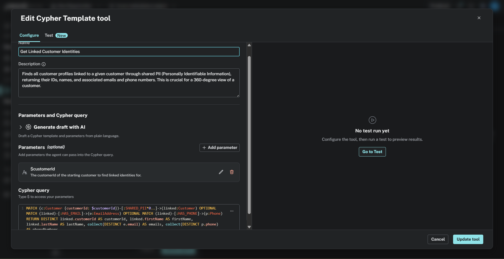

Remove any parameters this tool may currently have, such as customerId.  
Paste the below statement into the "Description" prompt.

    Ranks every multi-account resolved identity in the graph by combined successful-order revenue, highest first. A resolved identity is two or more Customer accounts linked via SHARED_PII (shared email or phone), whose orders should be counted together instead of per account. Use this tool whenever a question asks to rank resolved identities instead of accounts, compares multi-account identities against the official top-10 accounts list, asks whether any resolved identity out-spends the top individual customers, or otherwise wants combined revenue across a customer's linked accounts rather than one account at a time. Always call this tool for resolved-identity ranking questions — do not write ad-hoc Cypher for this.

Paste the below statement into the "Cypher query" prompt.

    MATCH (c:Customer)-[:SHARED_PII*1..2]-(other:Customer)
    WITH c, collect(DISTINCT other.customerId) + c.customerId AS componentIds
    WITH componentIds, reduce(m = c.customerId, x IN componentIds | CASE WHEN x < m THEN x ELSE m END) AS identityId, c.customerId AS thisId
    WHERE thisId = identityId
    UNWIND componentIds AS memberId
    MATCH (member:Customer {customerId: memberId})
    OPTIONAL MATCH (member)-[:PLACED]->(o:Order {status: 'success'})
    WITH identityId, collect(DISTINCT member.firstName + ' ' + member.lastName) AS names, sum(o.amount) AS combinedRevenue
    RETURN identityId,
        size(names) AS accountCount,
        names,
        combinedRevenue
    ORDER BY combinedRevenue DESC
    LIMIT 10  

Then, select "Update tool"

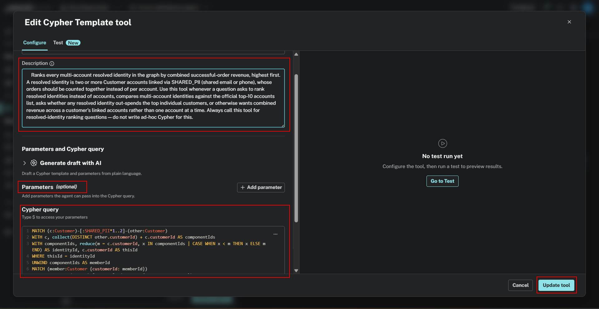

That will return you to the configure agent screen. Select "Update agent".

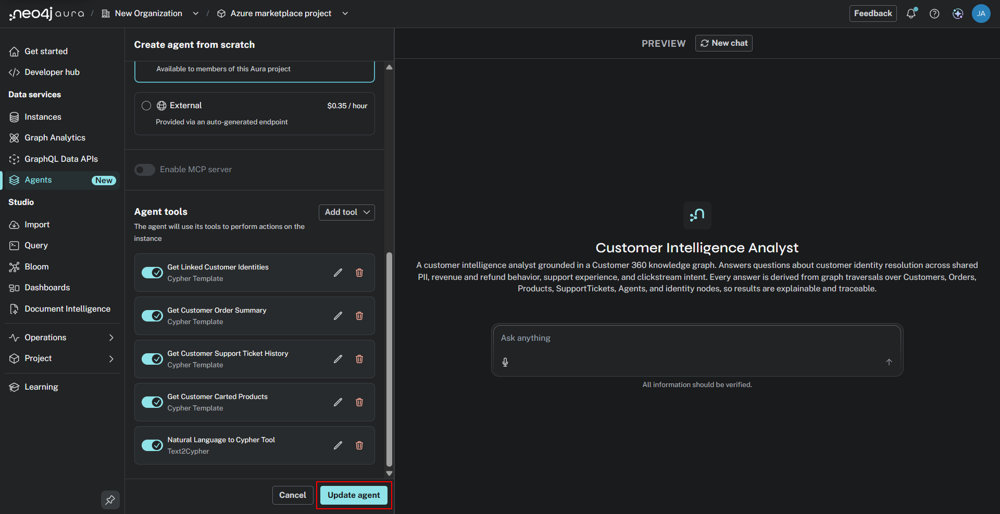

Now reselect the agent, enter, and execute the below statement:

    Now rank resolved identities instead of accounts. Do any multi-account identities out-spend the customers on the official top-10 list?

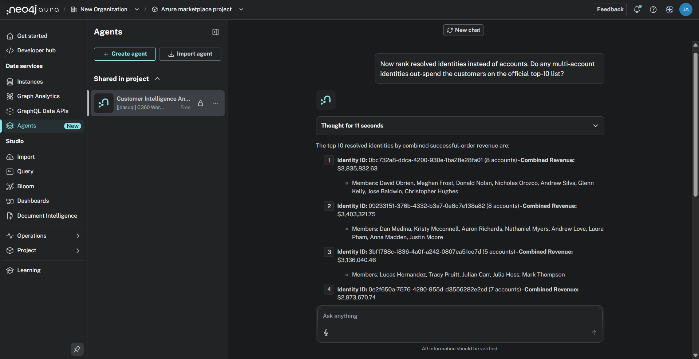

The agent leveraged the tool we configured, traversed `(:Customer)-[:SHARED_PII]-(:Customer)`, and aggregated revenue per resolved identity, because the identity linkage is stored as relationships. This would require a self-join and sequential recomputation on every query in SQL.

Let's push into multi-hop territory, combining refund behavior, support sentiment, and identity.

In the prompt, enter and execute:

    Of these resolved identities, which ones also show a refund-heavy order history or a pattern of negative-sentiment support tickets? Flag any that look like churn risks, and explain which relationships you traversed to get there.
    
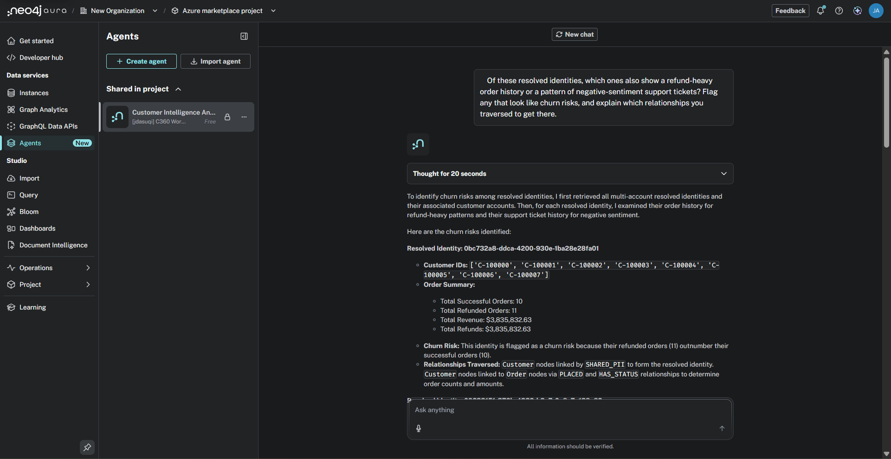

The agent combined three subgraphs in one traversal - `PLACED` orders for refunds, `RAISED` tickets for sentiment, and `SHARED_PII` for identity - the relational equivalent is a three-way aggregate join that grows with every added signal.

The agent also restated our governed definitions of "churn risk" from its instructions and the path it walked to get the answer.  Every result traces back to named nodes and relationships in the graph.

The agent you built here is deliberately small: one graph, one set of definitions, one analyst persona. Scale the same pattern across an enterprise and you get the [Enterprise Knowledge Layer](https://neo4j.com/blog/agentic-ai/enterprise-knowledge-layer/).

Once you're happy with your agent, you can expose it via an MCP server endpoint and call it from any application or another agent. 
See the following documentation for detailed information:  
[Aura Agent documentation](https://neo4j.com/docs/aura/aura-agent/).  
[General MCP documentation](https://neo4j.com/docs/mcp/current/).  
[Detailed GenAI developer](https://neo4j.com/developer/genai-ecosystem/model-context-protocol-mcp/).

Experiment and have fun!