# Lab 6 - Use Foundry

Let's investigate our deployment in the Foundry portal.  

1. Open [https://ai.azure.com/](https://ai.azure.com/).
    You should see the project that our deploy script created.  In this case it is proj-foundry-neo4j-demo.  
2. Click "proj-foundry-neo4j-demo" under the name column.

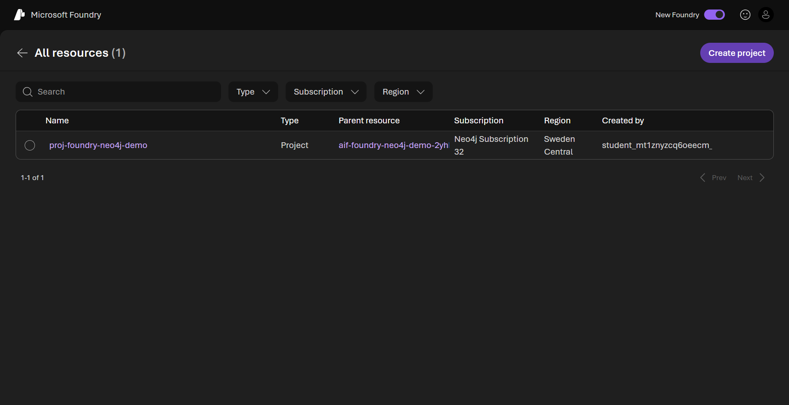

Select "Start building" in the "Build an agent" section.

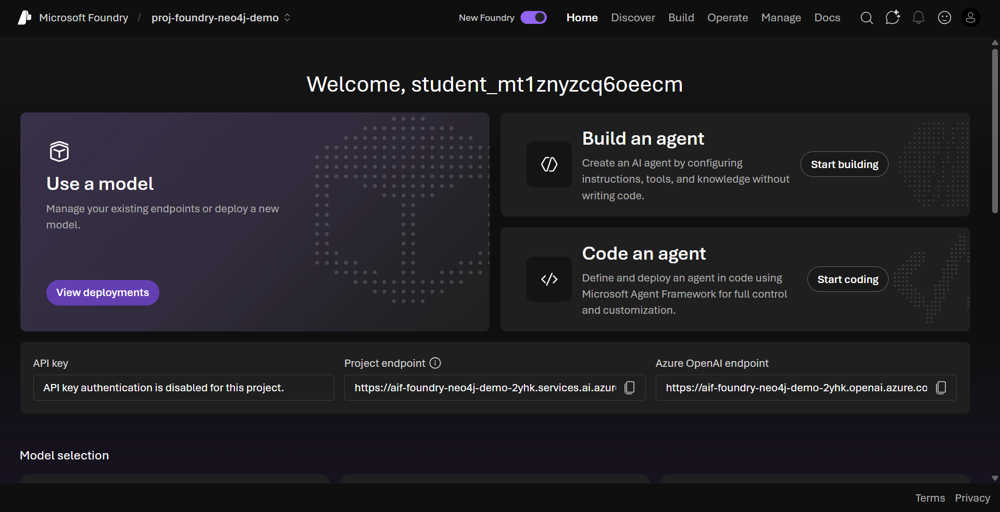

Enter the name "[YourLastName]-neo4j-research-agent"

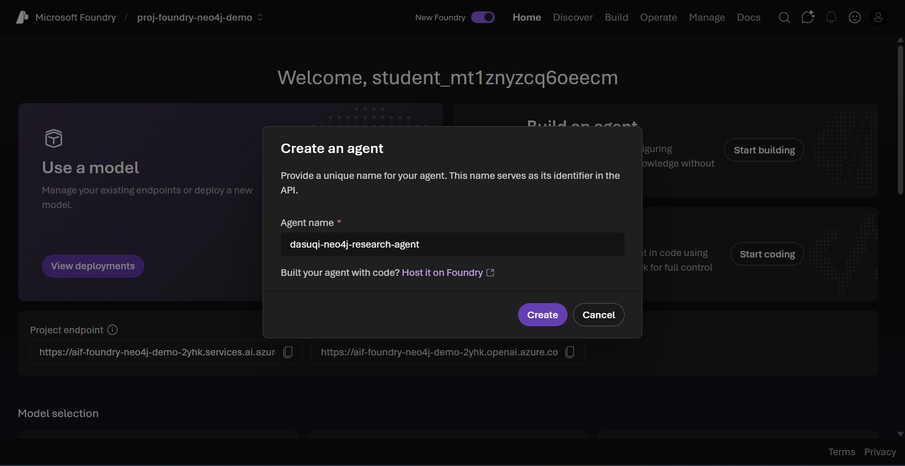

Click "Create." That will take a moment to run.

<img src="images/06.png" style="border-radius: 16px; box-shadow: 0 26px 50px rgba(20,20,30,0.28), 0 7px 16px rgba(20,20,30,0.32); margin: 56px 56px 56px 80px; max-width: 80%;"

For instructions enter:

    Role: customer intelligence analyst. Source of truth: a Neo4j knowledge graph reached only through the get-schema and read-cypher tools (read-only).  
    Be thorough and data-driven — cross-reference customer identity, orders, support history, and clickstream behavior; never treat an account in isolation.

    Workflows:

    Customer research: profile the customer → resolve their linked identities via SHARED_PII → fetch their orders and refund history → fetch their support tickets → fetch their clickstream and cart-add activity → synthesise into a single 360 view.

    Identity & revenue analysis: find resolved multi-account identities (SHARED_PII clusters) → rank by combined successful-order revenue → compare against the top individual accounts → cross-reference refund rate and negative-sentiment tickets across each identity → synthesise, flagging any that look like churn risks.

    Support operations analysis: list agents by ticket volume and average resolution time → identify agents whose resolution time is well above the network average → check whether issue type or sentiment explains the gap → synthesise, being explicit when no such pattern holds.

    Always project `id` properties (e.g. `c.customerId AS customer_id`, `o.orderId AS order_id`, `t.ticketId AS ticket_id`) so follow-up questions can build on them.

    Output:

    Cite every customerId, orderId, ticketId, and productId behind a claim. Use tables when comparing multiple entities (accounts, identities, agents, products), bullet lists for attributes of a single entity. Connect the dots — highlight resolved-identity membership, refund and sentiment patterns, and cases where a stated pattern does not actually hold up in the data.

    Grounding:

    Call get-schema once per conversation. You MUST call read-cypher before any factual claim about a customer, order, product, support ticket, agent, or resolved identity. get-schema alone is not data. Answer only from read-cypher rows. Never use prior knowledge. If read-cypher returns nothing, reply "the graph doesn't contain that". Use modern Cypher (`WHERE x IS NOT NULL`).

    Definitions:

    Use these consistently across every workflow: a "duplicate suspect" is a pair of Customer nodes connected by SHARED_PII.  
    A "resolved identity" is the full set of Customer accounts connected to each other through one or more SHARED_PII hops, and its revenue is the sum of Order.amount across every member account where status = 'success'; refund exposure means the same sum where status = 'refunded'.   
    A "churn risk" is a customer or resolved identity whose refund rate is meaningfully above the network average, or who combines refunds with a negative-sentiment support ticket.  
    An "underperforming agent" is one who has handled at least 50 tickets and has an average resolutionHours more than 1.5x the network-wide average.  
    "Abandoned intent" is an ADDED_TO_CART relationship with no matching successful order for the same customer and product. When a claimed pattern (e.g. issue type or sentiment explaining a performance gap) doesn't hold up against the data, say so explicitly rather than asserting a cause.

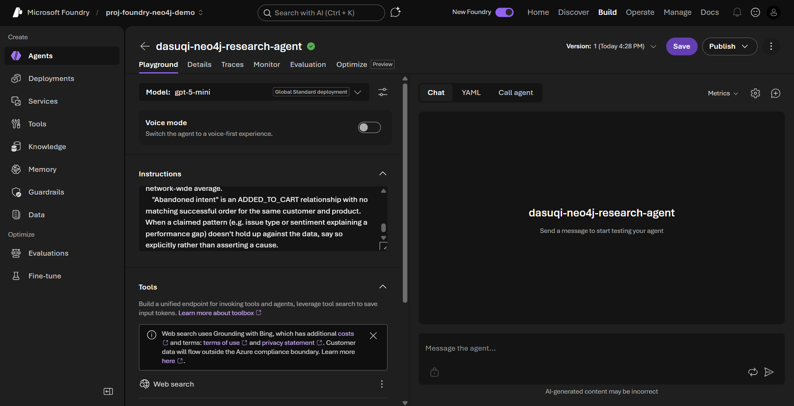

Now under tools click "Add."

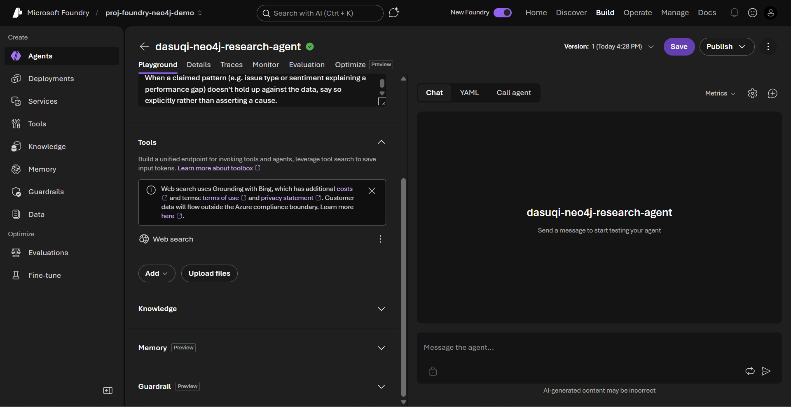

Click "Browse all tools."

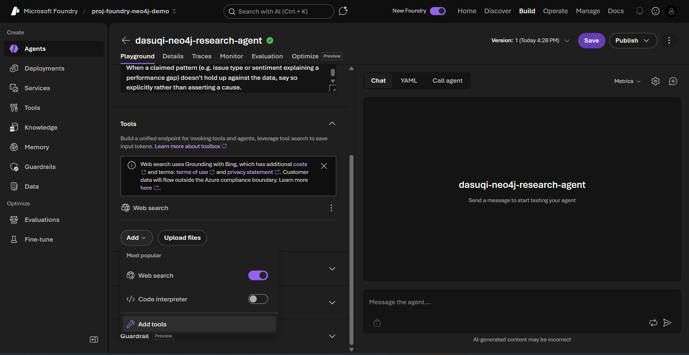

Click "Custom."

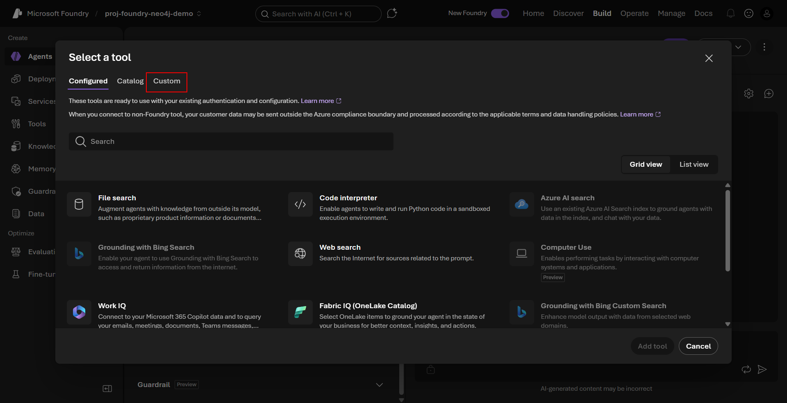

Click "Model Context Protocol (MCP)"

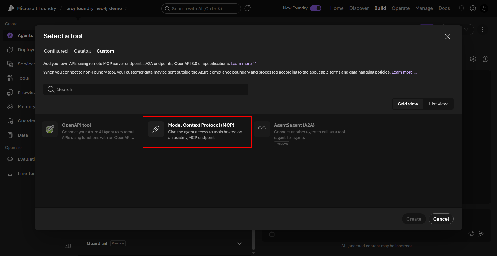

Click "Create."

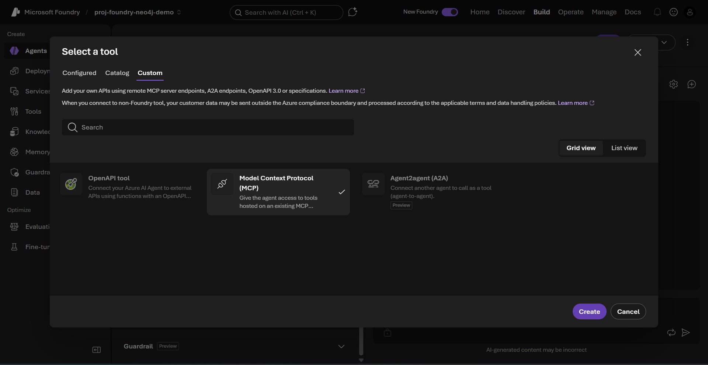

We're going to need to fill out these values.

* Name - [YourLastName]-neo4j-mcp
* Remote MCP Server endpoint - value from last lab (note if you don't have this, you can open your Cloud Shell and run cat neo4j-agent-integrations/microsoft-foundry/.env to get it)
* Authentication - Key based

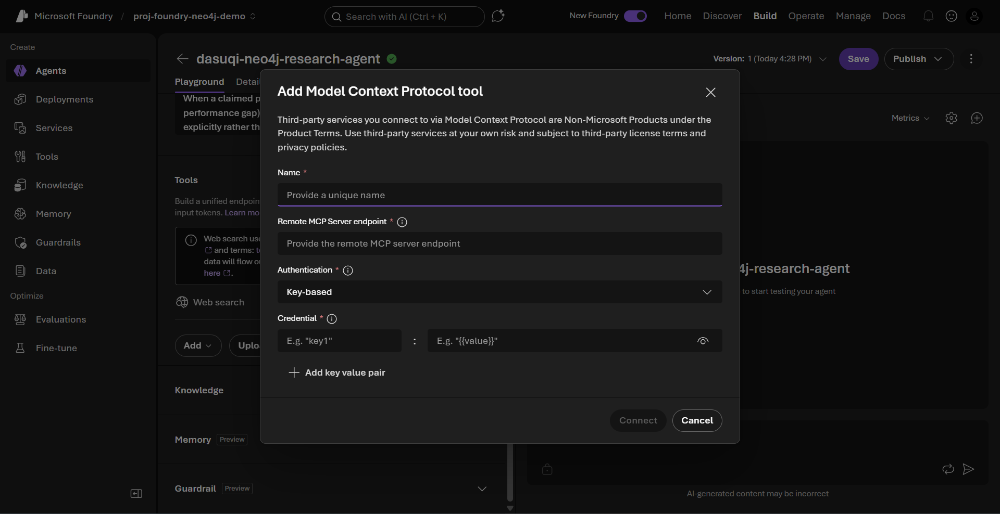

For the key/value pair, enter the values:

* Authorization
* Basic bmVvNGo6OXlBOEE5UkhjSzNIQWVhQTdqa1hOSkxaNkZiT1pwbXp6cnNoaDM4NE5tTQ==

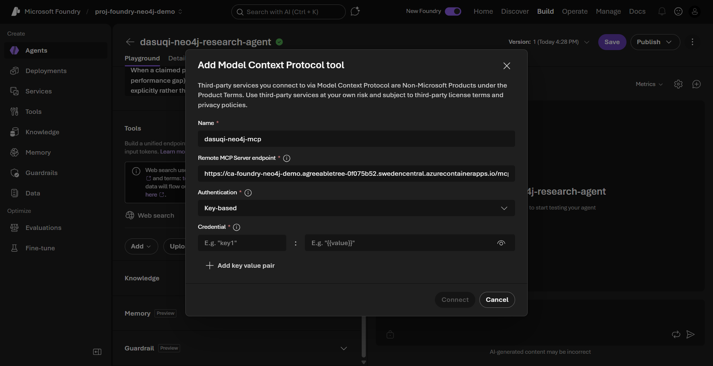

Click "Connect."

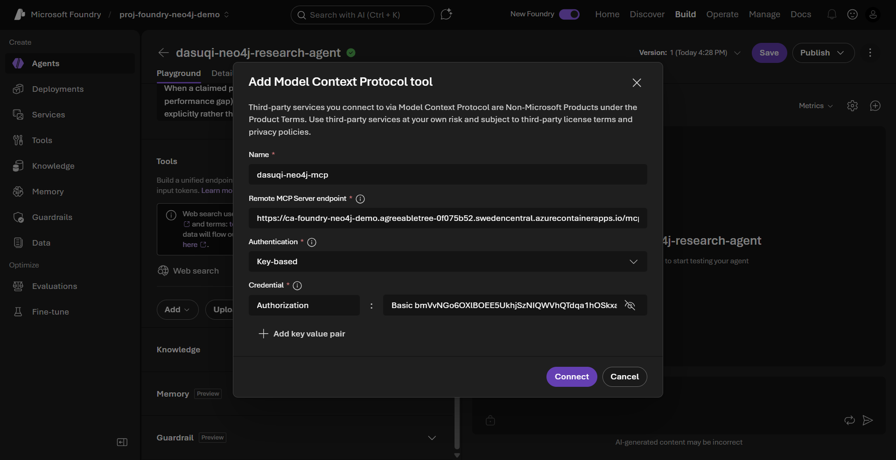

Let's remove the web search.  That way the agent will only use the MCP server for grounding.  To do so click the three dots next to web search.

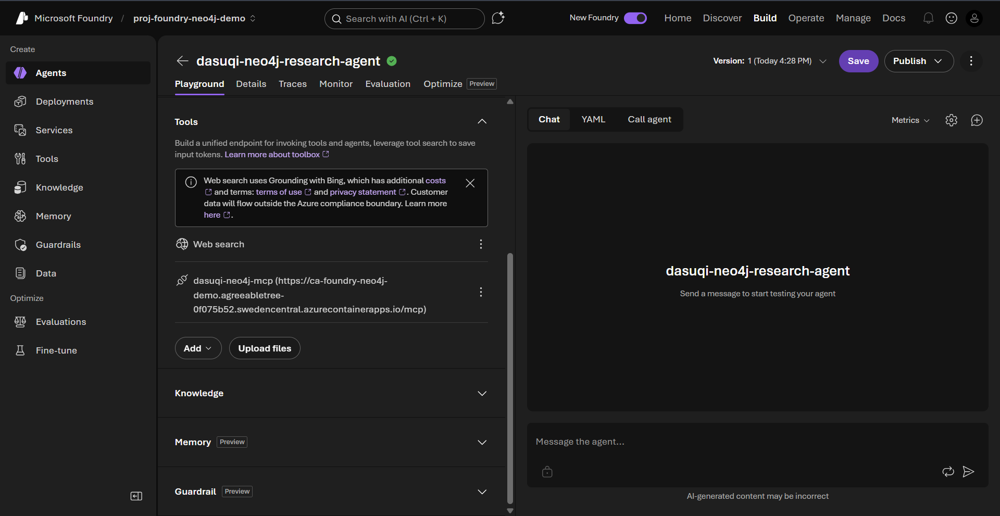

Click "Remove."

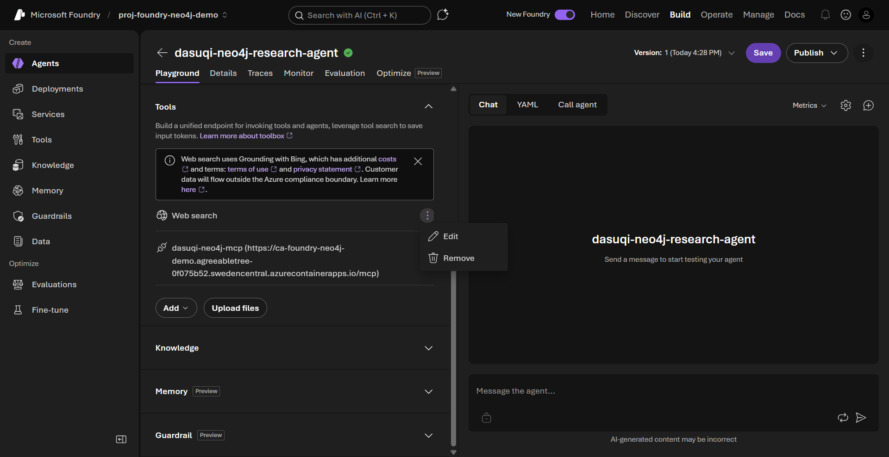

Now let's try our agent.  In the "Message the agent..." field type:

    Who are our top 10 customers by successful order revenue? Provide their customer id, first name, last name, and total revenue.

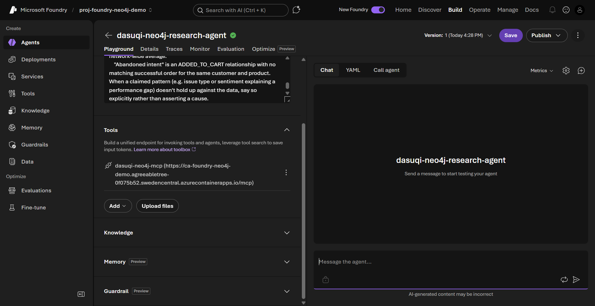

Hit enter.

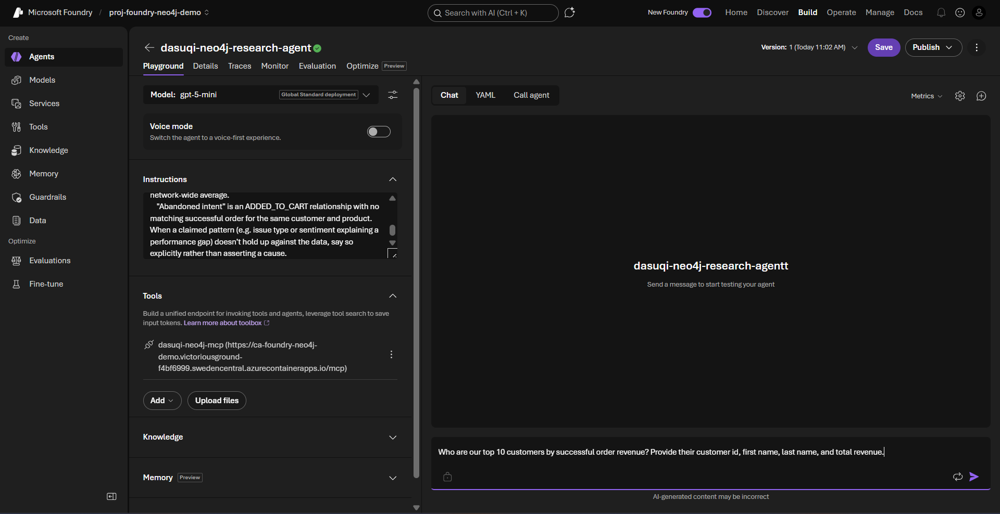

Click "Approve."

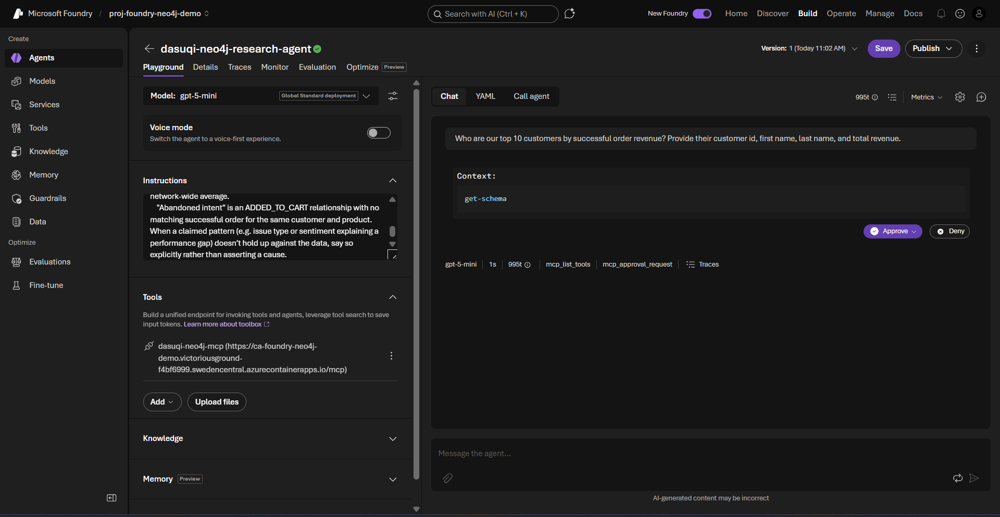

Click "Always approve this tool."

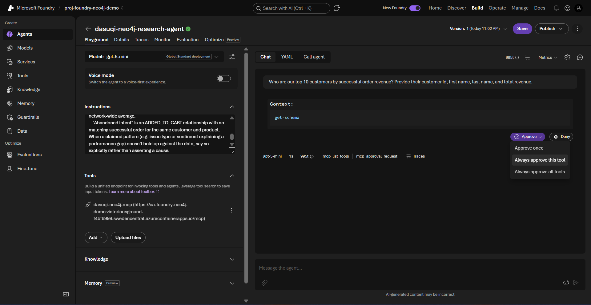

Click "Approve."

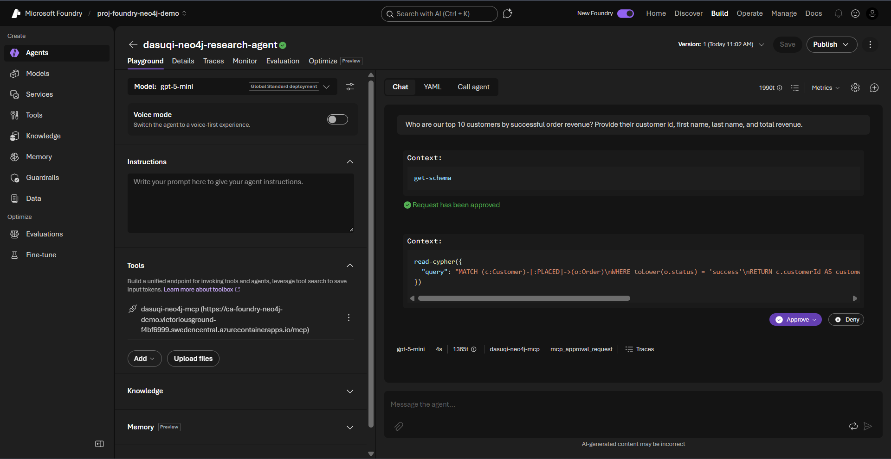

Click "Always approve this tool."

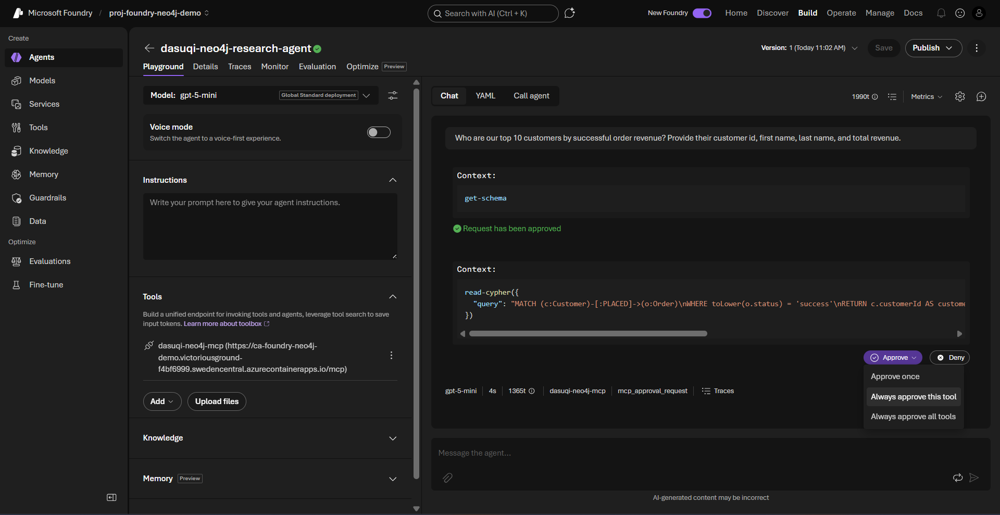

That gives this result.

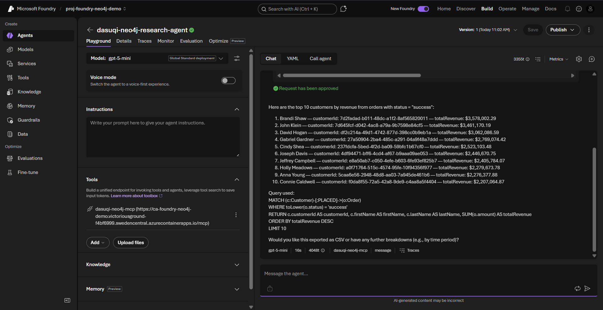

Be sure to re-paste your agent's instructions in the box, should they have been removed.
Let's try a different command:

    Who are the 5 most underperforming agents? Explain to me how you arrived to this answer.

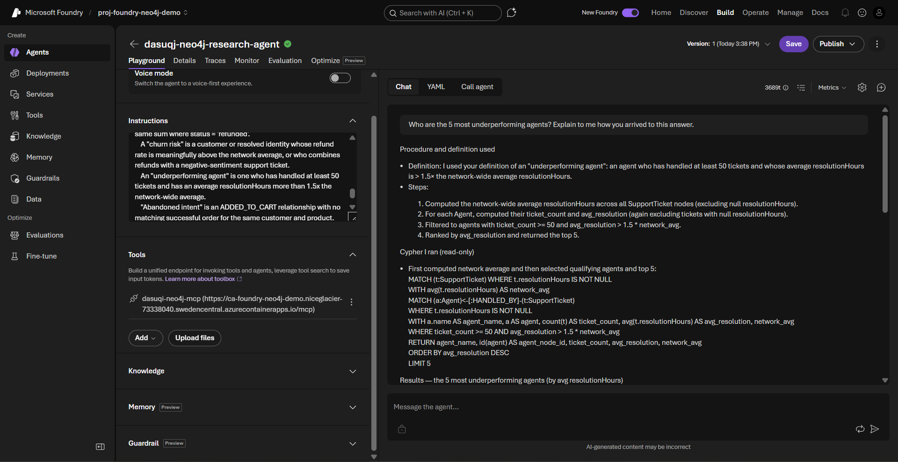

Take a moment to scroll through the agent's reasoning and explainability of how it came to these rankings and scored the agents.

You will notice the agent stating back our governed definition of "underperforming agent"; >=50 tickets handled AND avg_resolutionHours > 1.5×network average.

Here's another command to try:

    Which product has the most instances of abandoned intent?

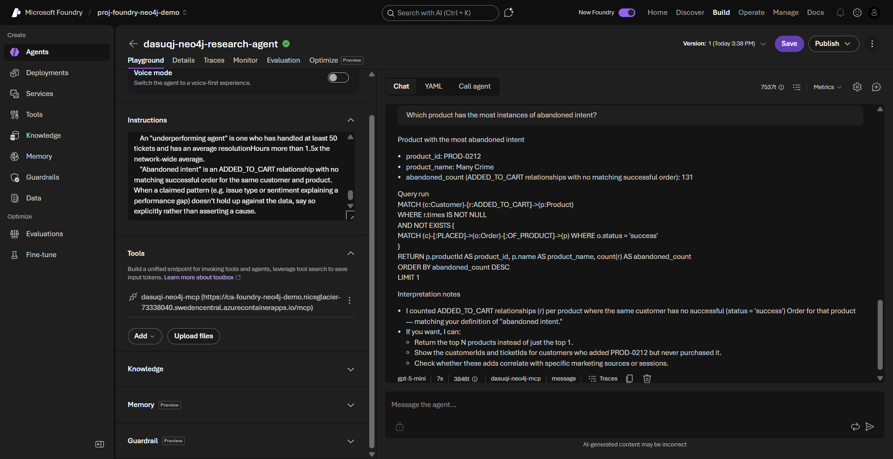

You will notice again the agent stating back our governed definition of "abandoned intent"an ADDED_TO_CART relationship with no matching successful order for the same customer and product.

This is the idea of providing the LLM with data context and governed business rules in action.

Feel free to explore and try your own ideas too!