# Lab 7 - Bloom

In this lab, we'll use Bloom, Neo4j's business intelligence (BI) tool, to explore our data.

Click on the 'Bloom' option in the left menu under Studio.

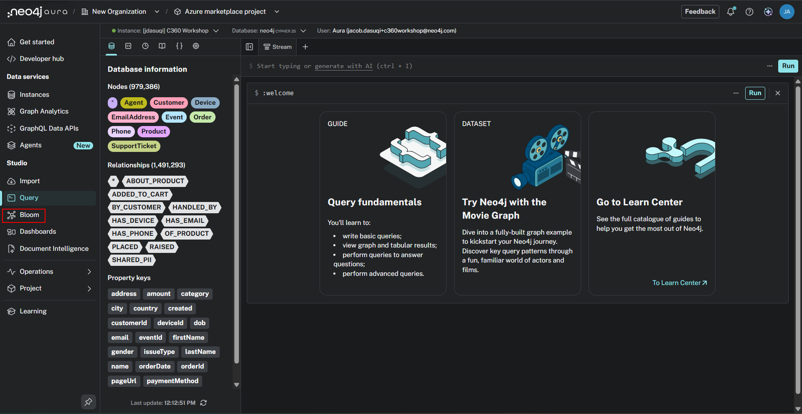

Now click on "Show me a graph."

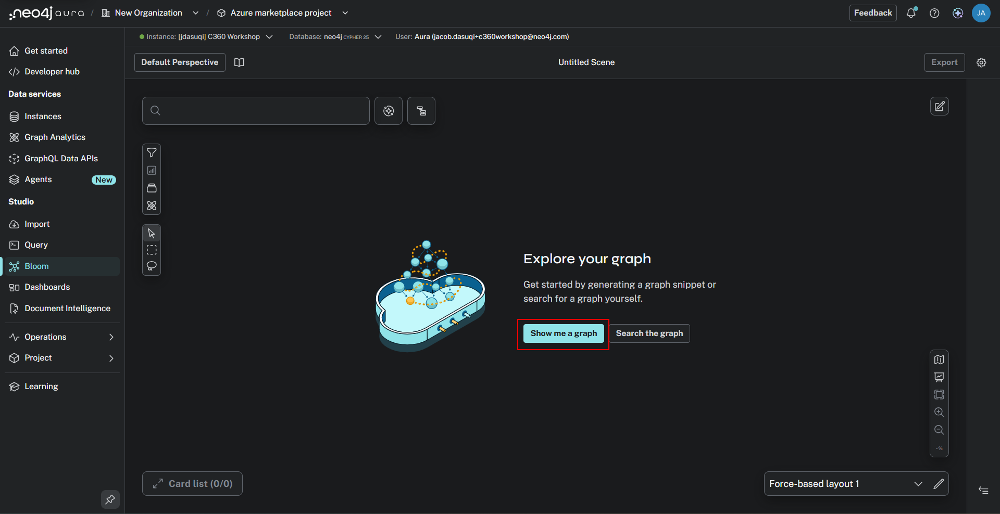

In this case, we got a view with a few different trees of customer, order, product, ticket, and event nodes and their relationships.  
We can mouse over any of the nodes to see its unique identifying property.

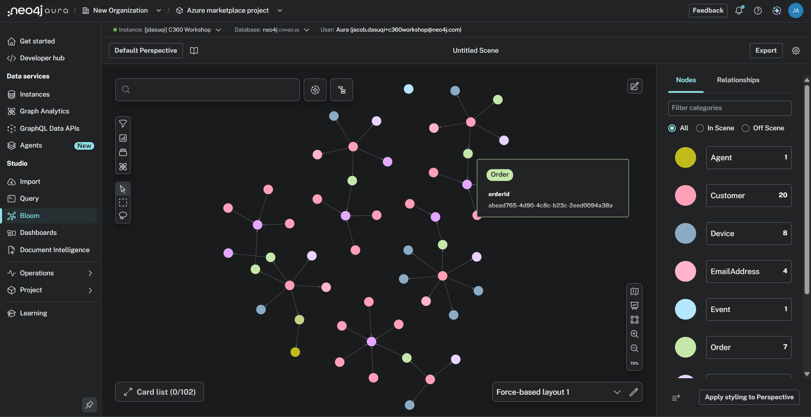

Now let's try finding a new graph. But first, let's clear the scene to ensure we start with a clean slate.  
Right click anywhere in the background where there isn't a node or relationship to open up a menu. Select "Clear Scene".

Click in the search bar.

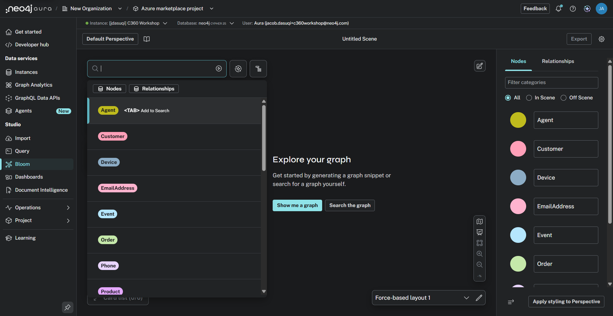

Select "Customer."

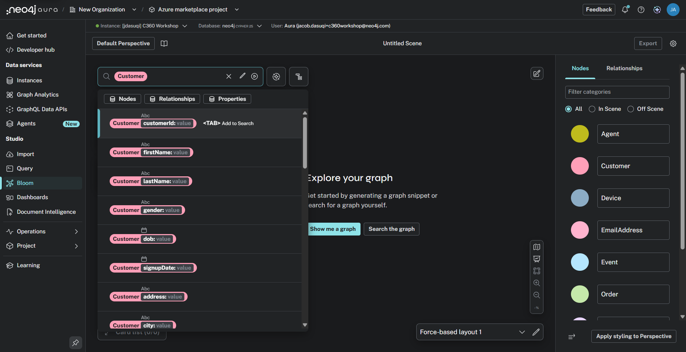

Now select the *directionless* "SHARED_PII" relationship.

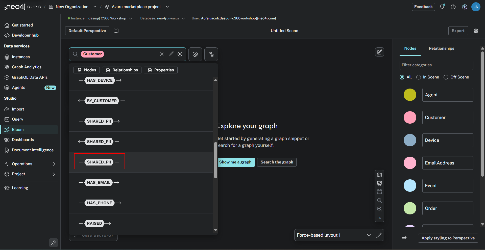

Now select "Customer" again to complete the pattern, and click Run Query.

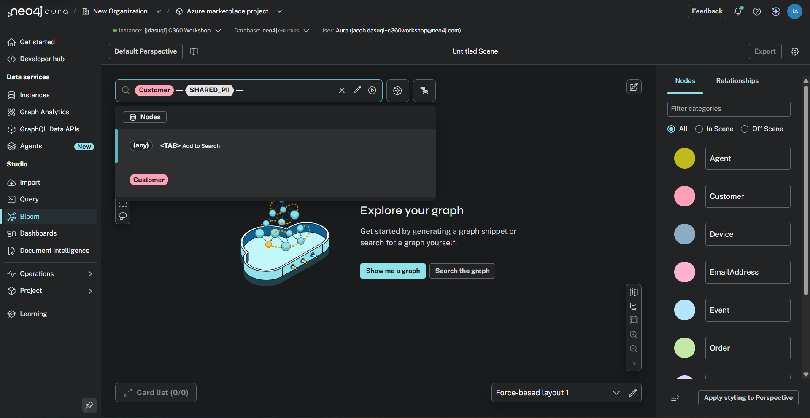

That gives us search results for every pair of customer accounts that share identity data - the accounts most likely to be the same real-world person.  Try right-clicking a pair and expanding to reveal *which* email or phone they share, and watch the pairs join up into rings.

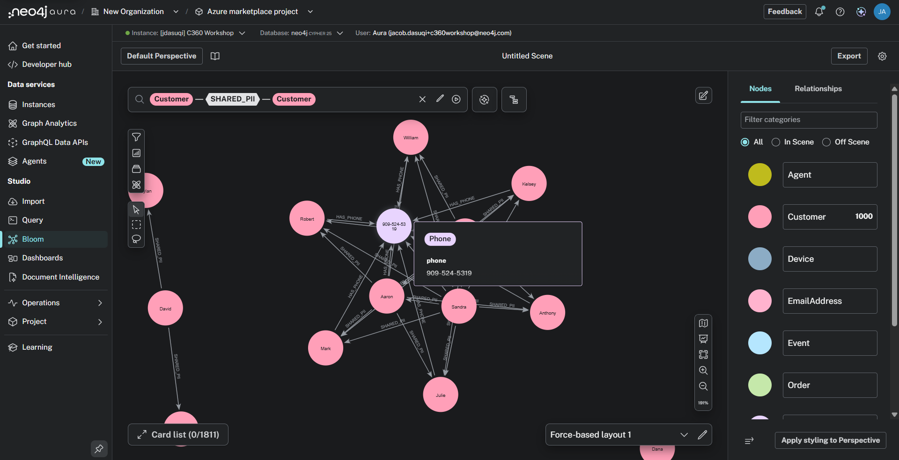

Next, we will apply some point-and-click data science to our graph.  Click on the atom icon to open the data science menu.

Click "+ Add" to add an algorithm.

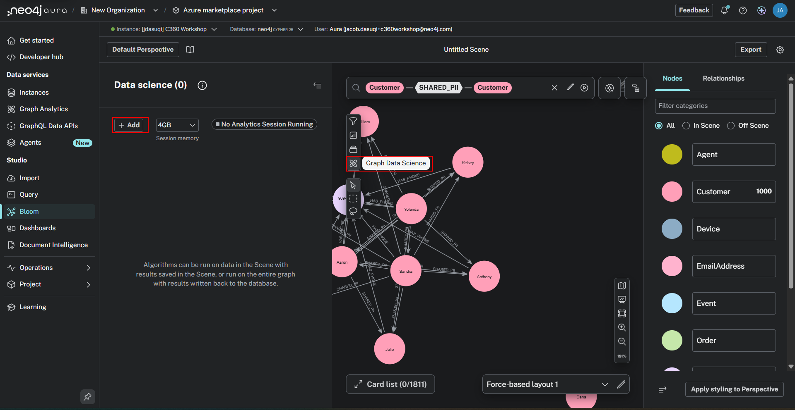

Click on "Select" to open the algorithm drop down.

Select "Louvain Community Detection."  This will partition the nodes in our scene into communities, based on how densely they're connected to each other.  This algorithm can be read about in deeper detail [here](https://neo4j.com/docs/graph-data-science/current/algorithms/louvain/).

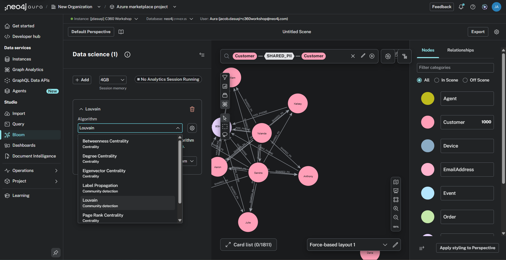

Click "Run algorithm" followed by "Apply to current scene".

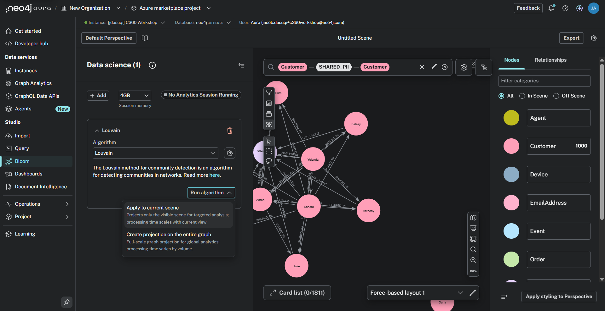

This spins up an additional ephemeral instance running Neo4j Graph Analytics.  That takes a few minutes.

Once it runs, we see this view.  We can choose how we want to visualize the results in the graph.

Choose "Unique Colors" and close the data science panel to get a better view.  Do that by clicking the icon above "Analytics Session Running."

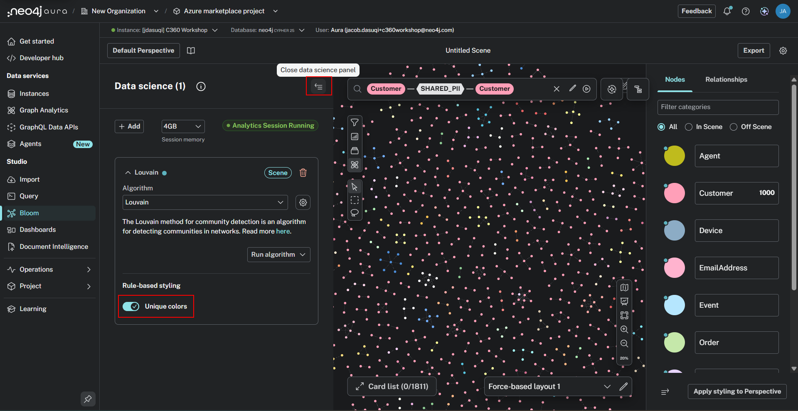

Each color is now a community: a cluster of customer accounts so entangled by shared identifiers that the algorithm considers them one group.  In entity-resolution terms, each color is a *candidate identity* - what your customer count looks like after you stop double counting.

We can double click on the Customer nodes within one community to investigate their Louvain "Score". This score is used used to assign each node a community ID. You will notice nodes of the same cluster possessing the same score.   

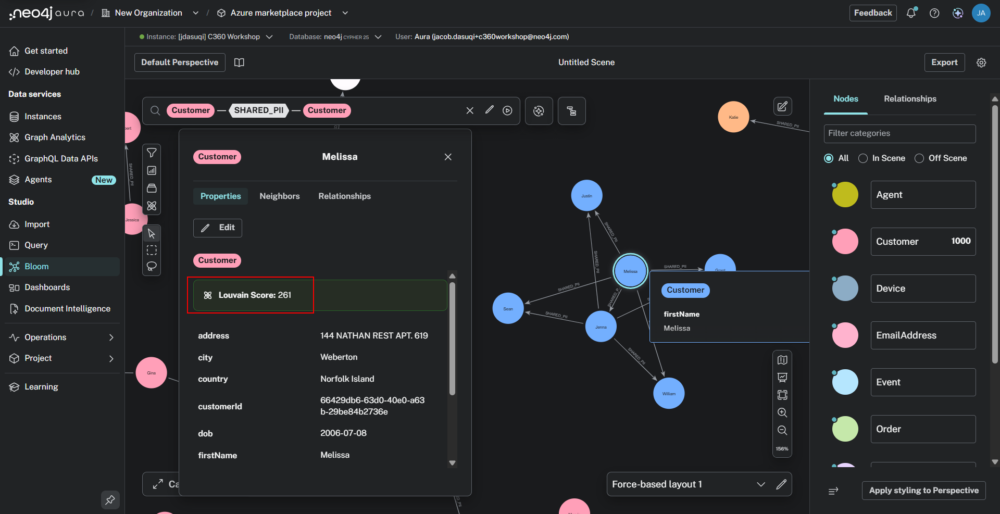

For the scene we've created, one color = one probable real-world identity.  Marketing sees deduplicated reach.  Risk sees account rings.  Finance sees true customer lifetime value.  Same graph, same algorithm, three audiences.

These are just a few examples of what you can do with Bloom.  Feel free to explore!
