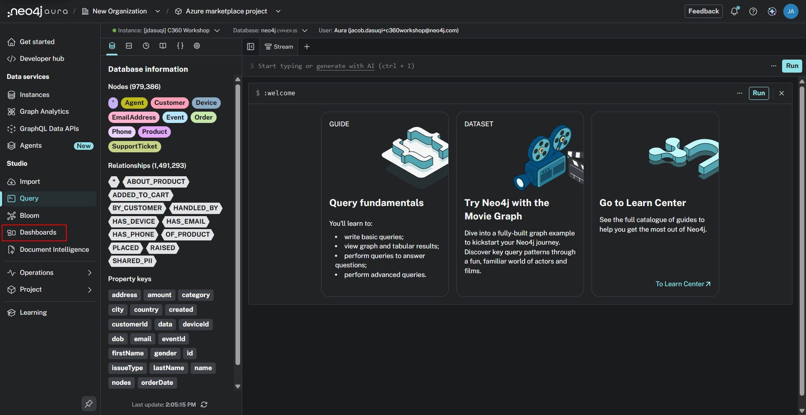
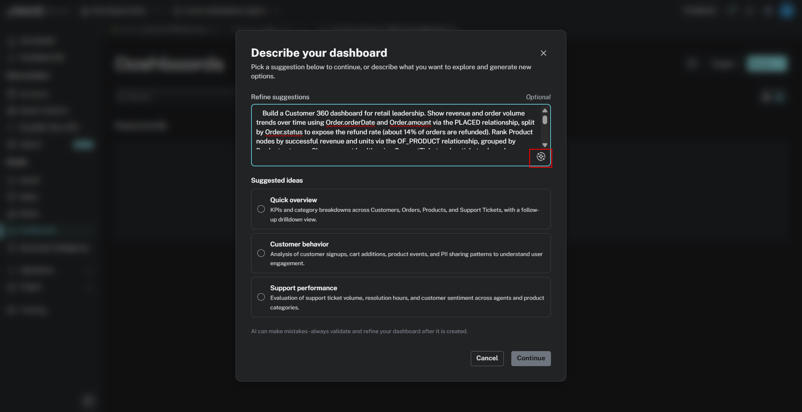
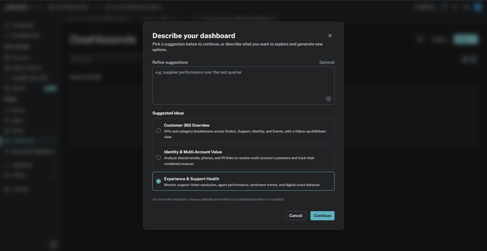
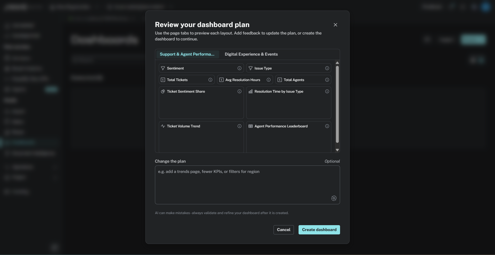
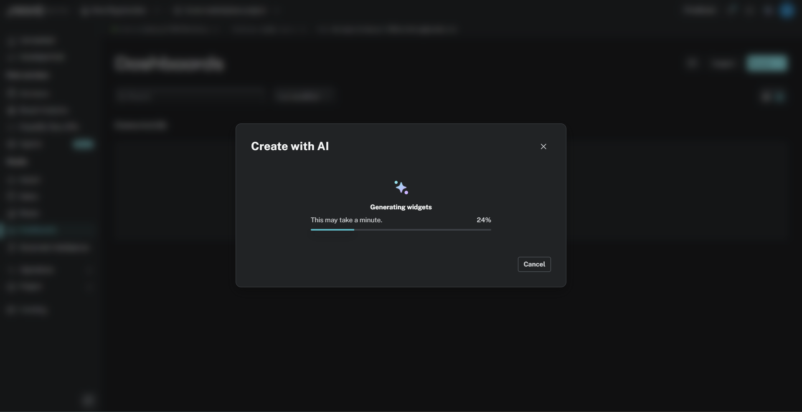
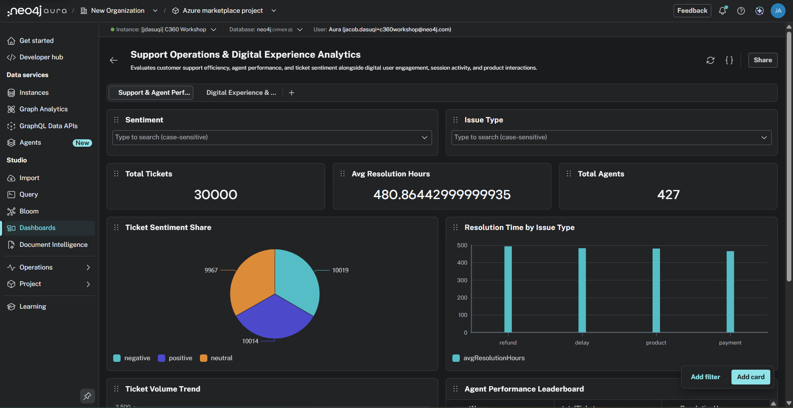
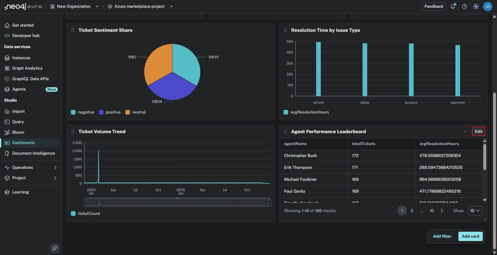
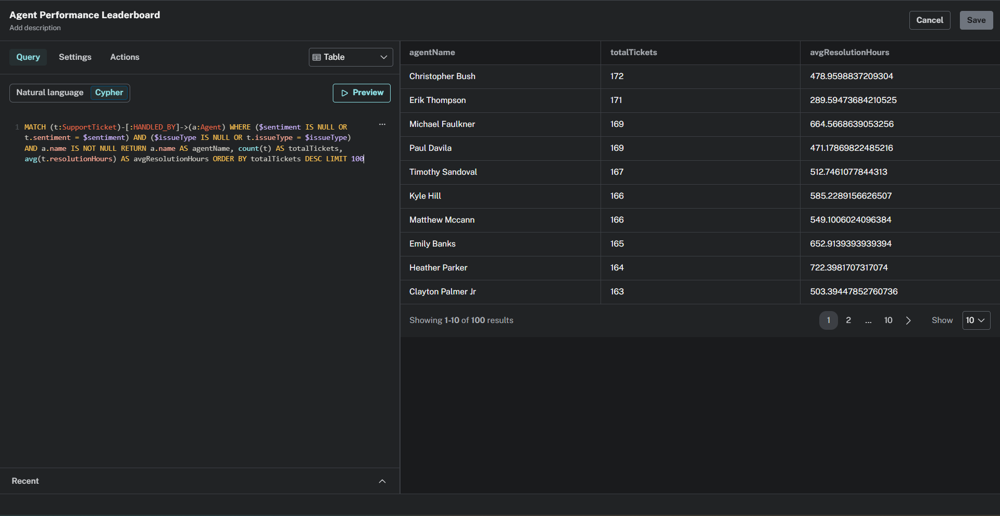
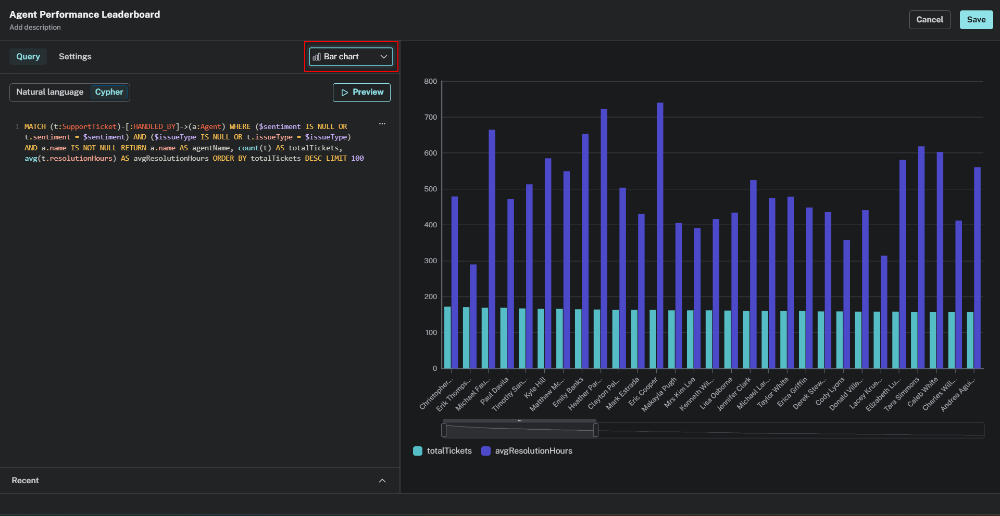

# Lab 8- Dashboards
In this lab, we'll use Dashboards, a Neo4j visualization tool, to explore our data.

In the Neo4j Aura console select the "Dashboards" option in the left menu under Studio.

Click "Create with AI."
In the prompt, enter the following, and then click the button in the bottom right of the prompt box to provide new suggestions:

    Build a flight operations dashboard for airline leadership. Show overall on-time performance and cancellation rate trends over time using Flight.scheduled_departure, Flight.departure_delay, Flight.arrival_delay, and Flight.cancelled. Rank Airline and Airport nodes by average delay and total cancellations, using the DEPARTS_FROM, ARRIVES_AT, and OPERATED_BY relationships. Include a geographic map of Airport nodes using latitude and longitude, colored by delay severity. Add a view highlighting which airports contribute most to cascading delays across the NEXT_FLIGHT chain between Flight nodes operated by the same Aircraft. Call out February 28th, 2015 as a notable spike in cancellations.

Select the idea that sounds most interesting to explore! I'm going to select Experience & Support Health.

Click "Continue".

Here, you can review the format of the dashboard and you may optionally enter a suggestion to have the format adjusted. When you're satisfied with the format, click "Create Dashboard" 

Wait for the dashboard configuration to complete.

Once completed, you will see metrics and visuals related to the data associated with your dashboard.

Click "Edit" on one of the figures in your dashboard.

Here, you can see the Cypher query input used to generate the corresponding figure. 

You can also adjust the display setting of the results. Take some time to poke around the dashboard!

Experiment and have fun!

We hope you enjoyed these labs. If you have any questions, feel free to reach out directly to any of us. We'd love the opportunity to explore and support your use cases with your data.

Your feedback is enormously appreciated. If you see bugs, please report them [here](https://github.com/neo4j-partners/hands-on-lab-neo4j-and-microsoft/issues/11).
